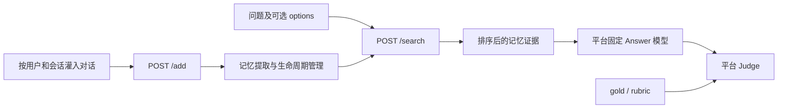
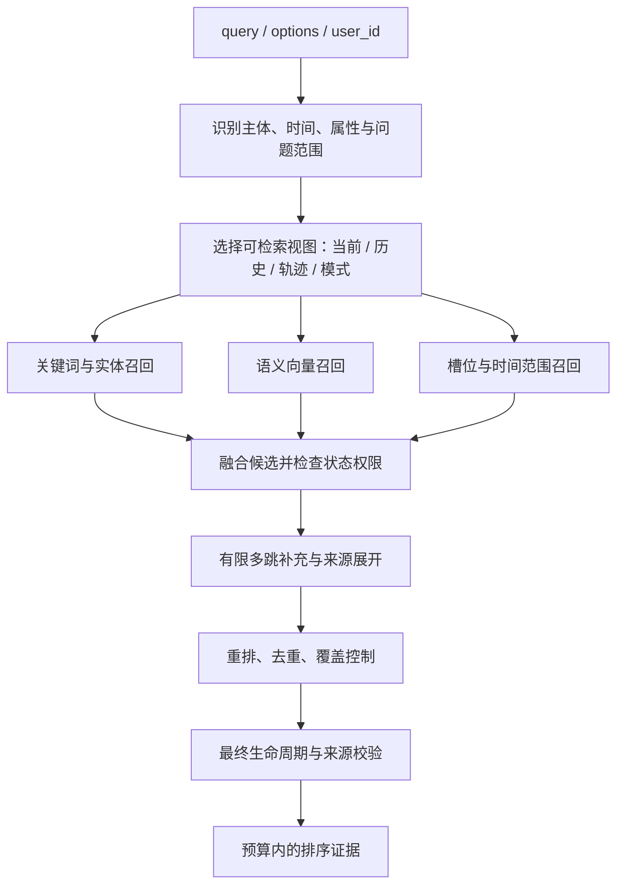

# Agent Memory：赛题理解与解题方案

设计日期：2026-09-05。状态：设计建议，尚未实现或取得评测成绩。

依据：[本地赛题规范](../Agent-Memory-赛题规范.md)。上游核验记录见 [04-调研依据与待确认事项](04-调研依据与待确认事项.md)。具体架构见 [02-系统架构设计](02-系统架构设计.md)，实施与验收见 [03-实施与评测计划](03-实施与评测计划.md)。

## 1. 核心结论

基于 **mem0 TypeScript 开源内核进行源码级改造**，实现具有时序与生命周期管理能力的证据检索服务，采用“原文证据 + 原子事实 + 状态变更记录”的统一记忆模型。复用与改造边界以 [05-mem0源码级改造方案](05-mem0源码级改造方案.md) 为准。

写入时识别主体、事实、时间、真实性及更新/遗忘操作；搜索时先决定哪些证据可以使用，再进行混合召回、有限多跳扩展和证据精简。服务不替 Answer 模型作答，也不根据基准名称切换硬编码策略。

工程上采用 TypeScript 优先的三个独立 Git 仓库。服务基于 mem0 的模型适配、批量抽取和混合检索实现演进，重构 SQLite 存储为统一事务；FTS5 是词法索引的目标实现，先保留原检索算法作为对照。评测端通过 HTTP 调用服务，独立运行 Answer/Judge；总控仓库只固定版本与编排。

优先建立合约和评测闭环，再提升生命周期正确性、跨会话召回和证据质量。复杂图数据库、无界 Agent 循环以及后台异步索引不进入首版关键路径。

## 2. 赛题到底优化什么

参赛系统只能控制交给 Answer 模型的记忆证据。最终正确率是证据覆盖、事实有效性、表达清晰度和固定 Answer 模型能力共同作用的结果。



按本地规范，正式题目为 LoCoMo 500 题、MemOps 500 题，单题二值计分：

`score = (correct_locomo + correct_memops) / 1000`

因此，补齐一个漏掉的关键事实、去掉一个过期值，都可能改变整题得分。返回 100 条只是允许的上限，不是越多越好。内部可召回更多候选，最终数量受问题覆盖、相关性及上下文预算共同控制。

## 3. 要求分层

| 层次 | 要求 | 设计对应 |
| --- | --- | --- |
| 赛题硬约束 | 只有 `/add`、`/search`、`/health` | 路由显式注册，不提供 Swagger、metrics、管理 API |
| 赛题硬约束 | `/add` 200 后立即可查，回显三个 ID | 同步完成处理与数据库提交，提交之后返回 |
| 赛题硬约束 | 证据排序、用户隔离、最多 `min(top_k,100)` | 用户存储边界、状态过滤、统一最终排序 |
| 赛题硬约束 | Docker 冷启动、超时、本地/离线回退 | 单独服务镜像、请求截止时间、分级模型适配 |
| 本项目工程要求 | 三个独立仓库、submodule 固定 commit | service / eval / workspace 各司其职 |
| 本项目工程要求 | TS 优先、运行时校验、独立 HTTP 评测 | 严格 TS、JSON Schema、黑盒测试 |
| 算法设计选择 | 原子事实、历史状态、混合检索、有限关系扩展 | 通过消融实验决定是否保留 |
| 尚待确认 | 模型资源、实际超时、Answer 模板与 token 预算 | 配置化、报告中明确实验配置与正式口径差异 |

`1–120s` 和 `1–60s` 表示规范给出的超时范围，不能直接假定正式平台总会允许 120s 和 60s。任何低于模型处理耗时的实际限制，都可能改变部署配置。

## 4. 上游核验对设计的影响

### 4.1 LoCoMo：主体与时间表达必须保留

所核验公开版本有 10 组对话、1,382 道问题；各组有 369–689 条文本消息。这与赛题抽取的 500 题不是同一规模，不应把公开全量结果称为赛题正式成绩。统计依据为固定版本的 [公开对话](https://github.com/mem-eval-suite/LoCoMo_refined/blob/887091190789e8d6760e70b9edd696539923dc4f/data/public/conversations.jsonl) 和 [公开问题](https://github.com/mem-eval-suite/LoCoMo_refined/blob/887091190789e8d6760e70b9edd696539923dc4f/data/public/questions.jsonl)。

对话中的 `user`、`assistant` 可以是两个真实参与者的角色映射。不能把全部 `assistant` 消息都当作机器生成噪声，也不能把全部第一人称事实绑定到请求的 `user_id`。`user_id` 是隔离边界；对话主体是边界内部的实体。

核验的 [refined Judge 代码](https://github.com/mem-eval-suite/LoCoMo_refined/blob/887091190789e8d6760e70b9edd696539923dc4f/src/llm_judge.py) 对时间精度及相对时间形式有专门约束，列表问题和偏好问题也有不同规则。因此原始时间表达必须保存；标准化时间用于检索，不应替换唯一的证据文本。评测应复用代码，而不能用“语义差不多就正确”的简化 Judge。

### 4.2 MemOps：遗忘边界和状态确认比“最近出现”更重要

抽查带干扰版本的更新、遗忘、反思样本，每份含 50 段会话，分别约 518、524、546 条消息；这是三个样本的观察，不代表全量分布。

更新样本同时出现已生效的新职位、未确定的未来职位以及第三方/助手干扰。遗忘样本存在“移出当前同事范围”的限定操作。由此采用确认状态、作用域和时间共同决定有效值，而不是按最近字符串覆盖。具体数据依据见 [更新样本](https://github.com/MemTensor/MemOps/blob/312af65e2c7b6d1b70f062ffa8b4cde32aaf6f35/generated_result/4-inject_evidence_with_distractors/A01_update.json)、[遗忘样本](https://github.com/MemTensor/MemOps/blob/312af65e2c7b6d1b70f062ffa8b4cde32aaf6f35/generated_result/4-inject_evidence_with_distractors/A02_forget.json)。

上游 [评测脚本](https://github.com/MemTensor/MemOps/blob/312af65e2c7b6d1b70f062ffa8b4cde32aaf6f35/5.5-evaluate_operation_metrics.py) 还包含生命周期诊断与特定探针规则。本赛题的 rubric 映射未给出完整代码，所以分开记录“上游复现”和“赛题配置复现”，不能认为两个口径天然相等。

## 5. 记什么：三类证据，分开管理

| 类型 | 内容 | 用途 | 主要风险与约束 |
| --- | --- | --- | --- |
| 原文证据 | 消息中的最小完整语义片段及必要邻接上下文 | 补抽取遗漏、保留细节和语气 | 必须经过更新/遗忘过滤，不能整段无条件回传 |
| 原子事实 | 主体—属性/关系—值，外加时间和确认状态 | 精确查询、去重、冲突处理 | 每条有原文来源；不允许无证据补全 |
| 状态与操作事件 | 记住、变更、撤销当前关系、删除具体内容 | 当前态、历史轨迹、边界控制 | 操作来源必须有效，目标必须匹配，避免误删 |

会话摘要只作为可选导航索引，不作为独立事实真源；由摘要命中的结果仍要回到合法的原文或原子事实。

长期记忆应过滤通用教程、寒暄及助手无依据复述，但**一次性真实经历也值得保存**，因为 LoCoMo 会问具体事件。区分“持久偏好”和“短期真实事件”，不能把“不长期有效”等同于“不值得记忆”。假设、计划、引用和未确认推断分别标记，不提升为当前事实。

## 6. `/add` 解题流程

### 6.1 输入整理与上下文延续

1. 验证字段和时间戳，保留原始消息；生成稳定的内部消息 ID。
2. 读取该用户、该 session 的时间锚点及末尾上下文。评测切块不能清空指代关系。
3. 解析 `[Session time: ...]`；事实发生时间优先参考明确事件时间和会话锚点，接收时间只用于审计。
4. 综合说话者标记、称呼、第一人称和明确引用识别主体。角色不能单独决定事实真实性。
5. 以新的 chunk 为变更输入，旧尾部只帮助理解；重复上下文不能重复写入事实。

若正式转换丢失了人物标记、且正文也不足以恢复，保存“本会话说话者 A/B”等局部身份与不确定性，不猜人物姓名。跨会话合并要求可追溯的同一实体依据。

### 6.2 提取结构化候选

一次批量抽取输出事实、事件、操作候选，包含：

```text
subject_ref / predicate / object
scope                    # 工作、居住、具体项目等限定域
modality                 # confirmed / tentative / hypothetical / quoted / inferred
time_text / valid_from / valid_to / time_precision / time_anchor
source_message_ids / source_spans
operation                # assert / update / retract / forget
operation_target / operation_scope
```

模型不得自行决定数据库 ID、任意 SQL 或跨用户目标。输出先经 schema 校验，再检查来源 ID 存在、引用片段确实来自输入、主体和时间范围合理。格式修复最多一次，且必须在请求预算内。

### 6.3 应用更新规则

以 `(subject, predicate, scope)` 作为候选槽位；属性还要区分单值与多值。例如当前职位通常是单值，爱好列表通常是多值。不能把第二个爱好当成对第一个爱好的覆盖。

| 新证据 | 处理 |
| --- | --- |
| 同一事实再次确认 | 合并来源，不重复扩张结果 |
| 同槽位、明确已生效的新值 | 新值成为当前态，旧值关闭有效区间 |
| 明确纠正此前错误 | 旧值标记为错误/撤回，保留纠正事件；不把错误值当作曾经真实状态 |
| 计划、条件、未最终批准 | 保存为计划，不覆盖已确认值 |
| 讲述更早的历史事实 | 加入相应历史区间，不按入库时间覆盖当前值 |
| 第三方相似事实 | 绑定第三方主体，不覆盖本人 |
| 助手复述且无独立依据 | 仅作上下文；与明确事实冲突时不得取代 |
| 同时点、同可信度且无法消解的冲突 | 标记冲突，保存限定语；不任意选一个作为确定事实 |

来源语义、明确生效时间、纠正关系优先于简单的新近性；置信度分数仅辅助排序，不等于真实性概率。

### 6.4 遗忘分为两种语义

**内容遗忘**：例如“忘掉我的旧门禁码”。目标值及其复述、摘要、派生事实、原文片段均不能通过搜索恢复；历史查询也不能绕过。检索面仅保留不包含原值的操作说明，以及精确的作用域标记。重复灌入旧请求不得复活内容。

**作用域撤销**：例如“把甲从我的当前同事中移除，他已调走”。撤销“当前同事”关系，保留明确的离职/调动事件和允许的历史关系。询问当前同事时不得返回已撤销的关系；明确询问人员变化时可返回历史证据。

本方案对内容遗忘采用“禁止返回”的策略，强于规范中的“不再优先返回”，目的是降低忘却值污染 Answer 的风险。这是设计选择，必须通过准确的目标绑定避免扩大删除范围。

不能只匹配 `forget` 关键词：“forget it”之类结束话题表达、第三方引语及否定的遗忘请求均不构成删除操作。解析不清且可能破坏生命周期一致性时，不提交一个声称成功的猜测结果。

原文中同时包含目标值与无关事实时，按片段拆分/屏蔽，保留无关事实。派生证据记录依赖关系，任何依赖被遗忘后，同步重建或禁用该证据，不能只删向量索引。

### 6.5 反思与抗噪

首版优先召回分散的行为证据，让固定 Answer 模型归纳。增强版可生成写入阶段的“候选模式”，要求来源可列举、明确标为推断，并受后续反证与遗忘失效控制。

跨会话的独立支持优先于同一内容多次复述；单次通用提问不直接推断用户长期偏好。推断结果不得覆盖明确陈述，也不根据搜索问题现场生成结论。

## 7. `/search` 解题流程



### 7.1 查询理解不产生答案

识别查询中的实体、属性、时间、列表/单事实/历史变化/反思需求。默认用规则和词法信息；必要时使用一次有 schema 的查询分析调用。该调用只产出检索条件或子问题，不产生最终答案。

“现在”表示已灌入对话中最新确认的状态，不按系统运行日期自动推进未确定计划。搜索 API 没有 `as_of` 字段；历史时点只能从 `query` 解析，不能擅自扩展接口。

`options` 仅作为对称的检索扩展：每个选项同等参与候选查找，最终仍按原问题相关性排序。不存在于记忆的选项不能变成事实，查询和选项均不能触发写入或遗忘。

### 7.2 混合召回与多跳

- 关键词索引覆盖姓名、日期、职位、专有名词和编号；中文输入需额外分词/字符二元组处理，不能只依赖英文分词。
- 向量索引覆盖同义改写和语义关联；查询向量必须与索引使用相同模型和维度。
- 结构化检索覆盖确定主体、槽位、时间区间；列表问题按问题定义的范围补齐候选集合。
- 起始可配置各路召回 80–120 条、合并上限 250 条；均属于待实验的超参数，不是评测协议。
- 用 RRF 等排名融合方式消除不同分数尺度影响，然后再做重排。SQLite 的 BM25 原始分数方向与通常“越大越好”不同，适配层负责统一。
- 多跳只沿明确关系或问题中间实体扩展，首版最多两跳、最多两轮；每条新证据都必须有来源。禁止无限关联全用户档案。

### 7.3 时间精度与证据表达

内部保存原始时间文本和标准化区间两套信息。例如在 2026-09-05 说“下个月搬家”：事件是计划，月份范围可记为 2026-10，但不能臆造具体日期，也不能在运行日期变化后自动认为已经搬家。

输出示例为“用户于 2026-09-05 表示：‘我下个月要搬到杭州。’（计划，未确认完成）”。精度和原始形式保留，避免强制 Answer 只看到计算后的日期。不能同时给出互相矛盾、没有明确限定的日期表达。

### 7.4 证据打包与最终防线

每条证据表达一个完整事实或一组紧密相连的支持片段，保留主体、时间、状态和必要上下文。重排后的证据包再次生成最终相关性分数，输出按该分数降序；分数表示排序依据，不宣称概率。

返回形状只使用赛题字段：

```json
{
  "data": [
    {
      "id": "fact-opaque-id",
      "content": "用户于 2026-09-05 表示：我下个月要搬到杭州。（计划，未确认完成；来源 session-001）",
      "score": 0.87,
      "created_at": "2026-09-05T09:00:00+08:00"
    }
  ]
}
```

`created_at` 在本实现中定义为该证据首次来源的消息时间戳，更新时间独立保存在内部；多来源证据在内容中标注必要的时间。该语义属于实现约定，须对齐平台最终要求。

最终返回数不超过 `min(floor(top_k),100)`；非负有限数的边界策略见架构文档。可先试验 8/16/32/64/100 条及 2k/4k/8k token 的组合，依据固定 Answer 的实际窗口选择。宁可返回较少完整证据，也不按字符直接截断否定词或生效条件。

候选原文、摘要、邻接窗口、图扩展及缓存都必须走同一生命周期策略。搜索结束前再检查用户归属、删除状态、来源有效性，避免从旁路把旧值或被遗忘内容重新带回。

## 8. 预期优势与取舍

| 选择 | 要解决的问题 | 代价 / 验证方式 |
| --- | --- | --- |
| 原文与事实并存 | 抽取遗漏与高精度查询同时兼顾 | 存储增加；检查每题证据 token 与覆盖率 |
| 当前态和历史分离 | 当前问题避开旧值，历史问题保持轨迹 | 状态规则复杂；专门测更新/纠正/撤销 |
| 按片段控制遗忘 | 防止泄漏，又保留邻接无关事实 | 来源依赖维护成本；加入旁路泄漏测试 |
| 多路检索 | 同时覆盖名字编号和语义改写 | 候选增加；通过融合与预算限制 |
| 轻量关系扩展 | 支持有限多跳与列表完整性 | 可能引入噪声；逐题检查增益和误召回 |
| mem0 源码级改造 | 复用现有模型/检索代码，并掌握同步提交和状态 | 需维护上游来源及自有改动；与固定原版对照 |

这些优势是设计假设。只有使用相同数据、Answer/Judge 和预算对比，才能认定某一组件提高了得分。
