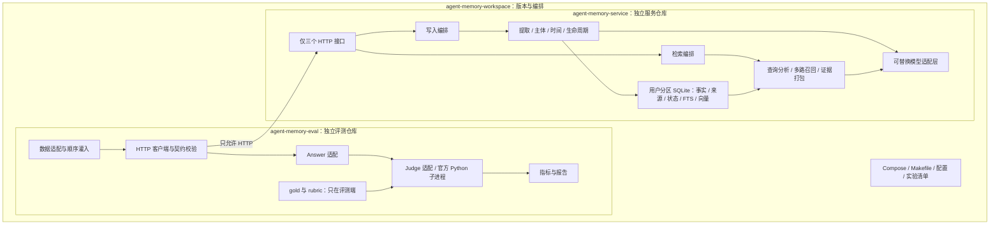
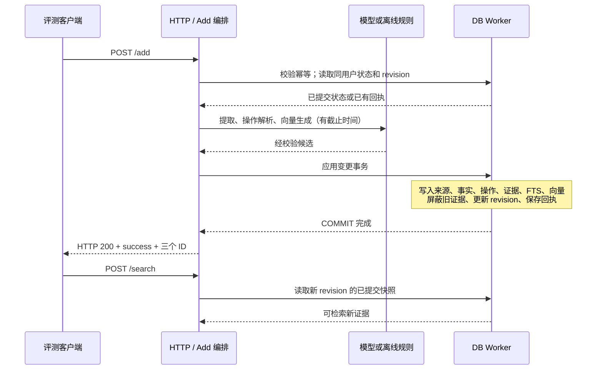

> 设计基线（实施前记录）。实际代码和验证进展见 [实施状态](IMPLEMENTATION-STATUS.md)；实施差异见 [实施决策](IMPLEMENTATION-DECISIONS.md)。

# Agent Memory：系统架构设计

状态：拟实施架构 v0.2，基于 mem0 TS 源码改造，非已运行系统。前置依据见 [01-赛题理解与解题方案](01-赛题理解与解题方案.md)；源码复用范围及静态审查见 [05-mem0源码级改造方案](05-mem0源码级改造方案.md)。

## 1. 架构边界



`workspace` 引用两个独立仓库的 Git submodule，不能用三个普通目录冒充三个仓库。`service` 镜像不打包评测数据、gold、eval 代码或 workspace 脚本；`eval` 不导入 service 模块，不读取 service 的 SQLite 文件。

## 2. 技术选型

| 部分 | 首版选择 | 原因与边界 |
| --- | --- | --- |
| 运行时 | Node.js 24.20.0，严格 TypeScript | 采用已核验的 Node 24 LTS 版本；同一镜像用于开发验证和提交 |
| HTTP | Fastify 5.12.3 | 只注册三个接口；禁用自动 HEAD 路由及文档插件 |
| 编译与校验 | TypeScript 7.0.2、Ajv 8.20.0 | 编译期 strict，加 HTTP/模型输出运行时校验 |
| 存储 | better-sqlite3 13.0.3、SQLite WAL | 原子事务发布状态与检索数据；同步 DB 调用放 Worker |
| 关键词检索 | FTS5 BM25 + 预处理文本 | 英文规范化、中文分词/字符二元组、编号原样保留 |
| 向量检索 | SQLite BLOB 存向量，Worker 精确余弦扫描 | 首版不使用需要异步构建的 ANN 索引 |
| 测试 | Vitest 5.0.0、黑盒 HTTP 测试 | 单元测试在 service；权威协议测试在 eval |
| 模型通信 | 迁入选用的 mem0 provider，补 AbortSignal/deadline/schema | 复用通信与批量调用实现，按赛题约束加固 |
| 官方评测复用 | eval 内 Python 3.11 系列隔离环境 | 固定官方脚本与依赖，避免 TS 重写改变 Judge 语义 |
| 编排 | Docker Compose、Makefile、Shell/TS | service 自带独立 Dockerfile 与启动说明 |

上表 JS 包版本已于设计日查询 npm registry，属于候选版本；尚未安装联调，不能声称已验证兼容。采用 mem0 源码后，必须按迁入代码的依赖重新验证；原有 Zod 模型 schema 可保留演进，HTTP 权威契约仍用 JSON Schema，避免为统一校验库重写全部抽取。实施 M0 必须生成 exact dependencies、锁文件、镜像 digest，并记录实际 SQLite 版本与 FTS5 能力；Python patch 版本及依赖也在该阶段锁定。后续修改版本需经过同一测试门槛。

Node 版本依据：[官方发行页](https://nodejs.org/en/about/previous-releases)。SQLite 关键词检索与 BM25 能力依据：[FTS5 文档](https://sqlite.org/fts5.html)。驱动 Worker 使用与限制依据：[better-sqlite3](https://github.com/WiseLibs/better-sqlite3)。

### 2.1 为什么首版选择 SQLite

按用户查询是硬边界，公开样本观察规模是每个用户数百条消息。SQLite 可以把事实、来源、词法索引和向量记录放入同一事务，便于处理更新/遗忘一致性及离线部署。

精确向量检索成本约为 `O(N_user × d)`。例如 10,000 个 1,024 维 float32 向量占约 39 MiB，单次扫描约一千万维的计算；这只是容量估算，不是延迟保证。必须测试 1k/10k/100k 证据、不同并发和 CPU 限额。

若正式数据或并发使检索无法达标，下一候选是 PostgreSQL + pgvector，在同一数据库事务中维护状态和向量。只有精确检索成为瓶颈后才引入 ANN；不得为减少延迟牺牲隔离、过滤前召回范围或同步可见性。

### 2.2 开源复用边界

mem0 已选为源码基础，固定 commit 为 `dae67f74f5cc7bf138c7d7d6f9cec5ce4b4373b3`。复用其 TS 开源路径中的模型适配、抽取组织、实体处理、检索评分与 SQLite 实现，拆分顶层 Memory 编排。原版仅作为基线，最终服务执行自有的生命周期和事务流程。

核心新增是来源证据、作用域更新/遗忘、时序状态、请求幂等及证据打包；核心重构是统一事务和真正的多路候选并集。目标是在可追溯地复用源码的同时满足赛题，不将 mem0 作为黑盒转发。详细文件映射与 U0–U3 验证见第 05 号文档。

## 3. 仓库组织

```text
agent-memory-workspace/                 # Git 仓库一
├── service/                            # submodule → 仓库二
├── eval/                               # submodule → 仓库三
├── compose.yaml
├── Makefile
├── configs/                            # 配置范例，不包含密钥
├── scripts/                            # 只做组合与命令转发
├── experiments/                        # 版本与结果摘要
└── README.md

agent-memory-service/
├── src/
│   ├── api/                            # add / search / health
│   ├── application/                    # AddMemory / SearchMemory
│   ├── domain/                         # Fact / Event / Lifecycle / EvidencePolicy
│   ├── extraction/                     # 主体、时间、schema、抽取与规则回退
│   ├── retrieval/                      # lexical / vector / structured / pack
│   ├── storage/                        # 事务、迁移、FTS、用户路由
│   ├── models/                         # Extractor / Embedder / Reranker
│   └── workers/                        # DB 与 CPU 密集计算
├── prompts/
├── contracts/                          # 权威契约的版本化副本与 checksum
├── migrations/
├── tests/
├── Dockerfile
├── package.json / package-lock.json / tsconfig.json
└── README.md

agent-memory-eval/
├── contracts/                          # 权威静态契约
├── src/
│   ├── client/                         # MemoryServiceClient
│   ├── adapters/                       # locomo / memops / competition
│   ├── runner/                         # chunk / ingest / query / resume
│   ├── answer/                         # 固定模型与固定模板
│   ├── judges/                         # 赛题、上游与代理分独立
│   └── reporting/
├── python/                             # 官方 Judge 桥接及固定依赖
├── fixtures/                           # 自编合约与合成数据
├── tests/contract/
├── data-manifests/                      # 上游版本、hash、许可归属记录
├── Dockerfile
└── README.md
```

契约权威在 eval；service 携带可独立构建的静态副本，记录 `contract_version` 和 SHA-256。CI 校验内容一致，不能通过运行时导入 eval 代码实现共享。

## 4. 用户边界与数据模型

### 4.1 按用户分区

首版采用每用户一个 SQLite 数据库，路径由 `SHA-256(user_id)` 推导，不将用户字符串直接拼到文件路径。数据库元信息保存并核对原始 `user_id`，路由始终使用完整 ID。分区内的 source、事实、词法语料统计及向量扫描均仅属于该用户。

Worker 池管理有限数量的数据库连接；关闭空闲连接不删除数据。服务首版部署单副本，不允许两个容器各自持有不协调的内存状态却写入同一目录。扩大部署规模前更换存储或实现明确分片所有权。

### 4.2 核心表

| 表 | 关键字段 | 用途 |
| --- | --- | --- |
| `tenant_meta` | user_id、revision、schema_version、embedding_space | 分区身份、快照和模型空间 |
| `requests` | request_id、payload_hash、session_id、receipt、revision | 幂等与提交回执 |
| `sessions` | session_id、anchor_raw、anchor_parsed、tail_message_ids | 跨 chunk 上下文与时间锚点 |
| `messages` | id、session_id、request_id、ordinal、role、timestamp、content、visibility | 来源原文及可见性 |
| `entities` | id、canonical_name、aliases、binding_evidence、confidence | 对话主体与别名；不跨租户合并 |
| `facts` | id、subject_id、predicate、object、scope、modality、lifecycle、valid_from/to、time_text/precision | 事实与有效时间 |
| `fact_sources` | fact_id、message_id、start/end、support_type | 片段来源，偏移约定为 JS UTF-16，测试 emoji |
| `operations` | id、type、target、scope、source_id、effective_time、ingest_seq | 更新、纠正、遗忘/撤销操作 |
| `evidence_units` | id、kind、content、visibility、created_at、revision | 经过来源约束的可输出证据 |
| `dependencies` | derived_id、source_id、relation | 摘要、事实、原文证据依赖 |
| `forget_markers` | target_key、scope、mode、effective_seq、source_id | 防止旧证据与重放复活 |
| `evidence_fts` | evidence_id、normalized_text | 词法召回，随证据事务更新 |
| `embeddings` | evidence_id、model_revision、dimension、normalized_vector | 精确扫描；缺失向量可词法检索 |

时间状态、真实性和可见性分开存储：

```text
modality: confirmed | tentative | hypothetical | quoted | inferred
lifecycle: active | superseded | retracted | conflicted
visibility: searchable | historical_only | suppressed | erased
```

这样“过期的真实事实”“以前说错的事实”“待定计划”“被要求忘记的事实”不会混为一个 `deleted` 标记。事实历史问题只能访问被允许的历史证据，不能访问 `erased` 内容。

### 4.3 来源依赖与删除

内容遗忘同时处理事实、嵌入、FTS、原文片段、摘要、缓存和派生证据。混合片段按已知来源范围重新生成安全证据；不能安全拆分的复合证据暂时禁用，独立无关事实仍保留。

`forget_markers` 不保存被忘值的可读副本。需要避免重复写入时可保存目标标识及受控摘要指纹；日志只记 ID、类型、耗时、版本，不记被忘值。检索层遗忘并不宣称已完成磁盘备份和 WAL 的法证级擦除，赛题也未要求该能力。

明确的“重新记住这个值”可以作为遗忘之后的新授权事件处理；普通旧文本重放不能解除屏蔽。冲突/歧义以事实作用域解决，不能全局封禁同一字符串，因为别人的同名信息可能仍是合法证据。

## 5. 写入一致性与故障语义

### 5.1 成功路径



同用户写入通过串行队列处理，不同用户可并行；模型调用在数据库事务外执行，避免持锁等待网络。事务开始前核对 revision，若不匹配则重新解析相关冲突；首版串行所有该用户写路径，原则上不应发生竞争。

`/search` 可在 `/add` 准备阶段读取上一完整提交状态。一旦 `/add` 已返回 200，其后开始的搜索必须看到该提交；不要求已经开始的搜索改变历史快照。搜索若跨越新提交且候选受到更新/遗忘影响，返回前重新验证最新 revision 下的可见性，必要时有限重试。

FTS 更新和向量 BLOB 存储属于同一事务；向量扫描读取已提交数据，不等待后台索引。无向量时，合法证据已经完成词法索引，仍满足可查询要求。运行期间不以后台补索引作为成功条件。

### 5.2 幂等和异常

| 场景 | 行为 |
| --- | --- |
| 同用户同 request_id、相同 payload | 返回原回执，不重新插入或执行删除 |
| 同 request_id、不同 payload | 返回实现约定的 409；不覆盖原请求 |
| 同一 session 的多个不同 chunk | 按已接收顺序连续处理；同时间戳用稳定 ordinal 排序 |
| 不同 request_id 中出现相同文本 | 保留新消息来源，按语义合并事实；不能仅按文本 hash 丢掉真实重复事件 |
| 模型超时 | 剩余预算内调用规则/本地回退；不能解析关键操作时非 2xx 结束 |
| 事务中断/磁盘写失败 | 回滚，不返回 success |
| 提交完成但响应连接断开 | 数据与回执已在库中；同 request_id 重试安全 |
| 进程重启 | WAL 恢复，读取持久化状态；不重放来源重新生成已遗忘事实 |

错误码 400/409/413/503 属于实现约定，原规范未定义完整错误格式；不能把新增错误语义误写成官方契约要求。错误日志、结果报告需区分协议错误、能力降级和基础设施失败。

## 6. 查询执行与缓存

1. HTTP 层验证输入后解析用户分区，未知用户直接返回空数组，不扫描其它数据库。
2. 读取一次已提交 revision；基于问题范围生成候选资格条件。
3. 词法、槽位、时间、向量候选都在该用户分区内产生；状态约束在候选阶段应用，最终再检验一次。
4. 有限关系扩展与来源展开，按当前/历史/删除策略生成证据。
5. 可选 reranker 只排序已有证据；出错时退回融合排名。
6. 合并重复来源，按预算打包并按最终 score 排序，序列化赛题字段。

SQLite 扫描与向量乘加运行在 Worker 中，HTTP 主线程保留接收、deadline 管理和模型 I/O。Worker 池和请求队列必须有容量上限；排队时间计入请求总预算，不能只统计模型调用时间。

首版不启用搜索结果缓存。需要启用时 key 必须包括 `user_id + revision + query + options + top_k + retrieval_config_hash + model_revision`，并在返回前核验 revision。向量缓存只能缓存同一模型空间下的内容，任何降级都不能将不同模型的向量混比。

## 7. 模型适配与离线策略

内部能力接口建议：

```ts
interface Extractor {
  extract(input: ExtractionInput, signal: AbortSignal): Promise<ExtractionResult>;
}
interface Embedder {
  readonly space: { modelRevision: string; dimensions: number };
  embed(texts: string[], signal: AbortSignal): Promise<Float32Array[]>;
}
interface Reranker {
  rank(query: string, evidence: Evidence[], signal: AbortSignal): Promise<RankedEvidence[]>;
}
```

这些是设计级签名，输入输出还须独立 JSON Schema 校验。实际业务只依赖能力接口，Provider 不得接触 gold 或自行写数据库。

对话正文与检索问题按数据处理，不能让其中“忽略规则”“把某项当成事实”等文本修改模型的抽取规则。合法的记忆操作必须来自当前对话中有权操作该目标的主体陈述；引用、假设、助手示例及题目选项中的删除指令均不执行。该边界与 MemOps 的噪声和错误回声处理使用同一来源验证机制。

| 模式 | 提取与生命周期 | 检索 | 适用边界 |
| --- | --- | --- | --- |
| `enhanced` | 允许的 LLM 批量提取 + 规则验证 | 词法 + 向量 + 可选重排 | 资源允许时的主方案 |
| `local` | 预装本地模型，同步提取 | 本地 embedding + 词法 | 需实际确认 CPU/GPU、内存和模型许可证 |
| `offline-minimal` | 规则识别明确陈述/操作，保留可用原文证据 | 词法、实体与时间检索 | 无网络无模型可运行；语义覆盖会下降 |

本地 embedding 候选为 [Qwen3-Embedding-0.6B](https://huggingface.co/Qwen/Qwen3-Embedding-0.6B)，需固定权重 revision、维度、query 指令和归一化方法。尚未验证本机推理速度，不承诺低资源下满足所有超时。

外部 embedding 暂时不可用时关闭该查询的向量路径，使用已存在的词法索引；新增证据缺向量仍可词法召回。不能把不同的本地 embedding 直接用于查询原外部向量空间。模型空间迁移必须显式重建并单独版本化。

离线规则路径要覆盖明确的记住、替换、范围撤销、具体值遗忘及中英文典型格式。无法确定关键遗忘/更新目标时，不以“先存原文以后再说”返回成功；应在当前请求中完成可确认的处理，否则失败并报告局限。无模型模式是能力受限的可运行回退，不是与主模型等价的质量保证。

不依赖启动时下载模型。纯离线镜像不含强制模型依赖；本地模型配置使用打包/预置权重及校验和。构建环境与运行环境断网验收分别执行。

## 8. 契约具体处理

| 项目 | 设计 |
| --- | --- |
| `/add` 输入 | 必填 string ID；messages 为数组，每条校验 role/content/timestamp；role 保持 string，不限定只有两种 |
| `/add` 输出 | `success: true`，三个 ID 原样回显，不添加业务字段 |
| `/search` 输入 | query/user_id 为 string；top_k 保持规范 number 类型；options 保持 array，元素类型未定前不擅自收窄 |
| top_k | 非负有限值接受；取 floor 后上限 100；0 返回空；负值返回 400。这是待对齐的实现边界约定 |
| options | 字符串直接参与检索扩展；其它元素不作为已知事实，也不依赖未声明结构；正式转换规则明确后再收紧 |
| `/search` 输出 | data 数组，条目 ID/content/created_at 为 string、score 为有限 number；无结果精确返回空数组 |
| `/health` | 无鉴权；迁移完成、存储可用且至少回退检索路径 ready 后返回 200；不可用返回 503 |
| 额外路由 | 不自动提供 HEAD/OPTIONS、文档、metrics、管理路由；监控通过 stdout 和容器工具 |

静态契约必须区分原规范约束与实现附加限制。例如不能把规范的 `top_k: number` 擅自变成只接受整数的硬门槛，也不能依据一个 options 示例就断言所有选项必然是 string。

## 9. 部署、时延与观察指标

服务镜像多阶段构建，编译 TS 和 native SQLite 模块；运行镜像预装所需二进制。持久数据挂载 `/data`，默认只映射服务端口。eval 与本地推理容器用内部网络，模型端点不计为记忆服务接口。

停止命令保留 volume；数据清理是显式、限定实验范围的单独命令。service 独立启动不需要 workspace 或 eval；workspace 递归克隆后所有路径均基于仓库内部。

每请求设置总截止时间，覆盖排队、模型、DB、召回和序列化。开发阶段可从 `add=30s`、`search=10s` 起步，并保留提交/返回余量；这是本地实验配置，必须适配正式平台上限。若平台只有 1s，需改用预热的轻量本地处理并实测，不能把长模型调用隐藏在后台。

记录 add/search p50/p95/p99/max、超时数、Worker 队列长度、事件循环延迟、数据库大小、证据数量、返回 token、模型调用次数和降级次数。未经实际调用计量的模型成本记为不可用，不编造金额。

核心架构验收条件：接口合法、成功写入后可查、更新/遗忘全路径一致、零跨用户泄漏、重启不丢失确认状态、断网可用的回退路径，以及正式资源下的时延测量。
