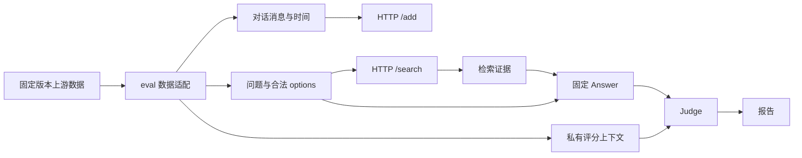

> 设计基线（实施前记录）。实际代码和验证进展见 [实施状态](IMPLEMENTATION-STATUS.md)；实施差异见 [实施决策](IMPLEMENTATION-DECISIONS.md)。

# Agent Memory：实施与评测计划

本计划面向后续开发，所有里程碑当前均未开始。依赖 [解题方案](01-赛题理解与解题方案.md) 和 [系统架构](02-系统架构设计.md)。

技术路线已明确为 mem0 TS 源码级改造。M0 增加上游版本冻结、源码及测试迁入、来源清单；M1 先建立原版 U0 与迁入重构版 U1，M2/M3 分别形成 U2/U3。具体顺序见 [05-mem0源码级改造方案](05-mem0源码级改造方案.md)。下文 B0–B6 继续作为组件消融配置，不表示各模块全部从零实现。

## 1. 先打通闭环，再增加算法复杂度

| 阶段 | 工作与所属仓库 | 完成标准 |
| --- | --- | --- |
| M0：契约和工程基础 | 创建三个独立 Git 仓库；eval 权威契约；service 独立镜像；workspace submodule 和命令入口 | 递归克隆可构建，strict typecheck 通过，三个接口及错误边界黑盒验证通过 |
| M1：可测最小系统 | service 原文证据、SQLite/FTS、用户隔离、幂等；eval 分块灌入、固定 Answer/Judge 接口、结果记录 | 两类数据各取一小组跑通；断网 smoke；先建立词法 baseline，无主观分数承诺 |
| M2：生命周期 | 原子事实、主体绑定、计划/确认区分、更新、纠正、遗忘边界、原文及派生证据屏蔽 | 生命周期合成用例全部通过；专门报告 stale-value、forget leakage、over-forget |
| M3：召回质量 | 语义向量、多路融合、时间检索、有限关系扩展、预算打包、可选 reranker | 相同 Answer/Judge、样本与预算下相对 M2 进行配对比较，记录收益和退化 |
| M4：冻结与交付 | 模型/依赖/镜像版本固定、全量回归、故障注入、干净部署、最终评测报告 | 三仓库精确 commit 可追溯；未解决失败明确列出；正式配置可用时完成赛题配置复现 |

M1 是工程基线，不代表已经满足全部记忆能力要求；M2 才形成完整能力候选。时间安排需按人员、算力和正式截止时间制定，不在信息缺失时承诺天数。

可以并行开发 service 的核心实现与 eval 的 HTTP/数据/报告能力，两端以 M0 契约协作。workspace 在两个仓库各自独立构建通过后做集成，不接管其业务代码。

## 2. 评测数据流与防泄漏



适配器必须构造字段白名单，而不是将上游 sample 直接序列化。`gold_answer`、`gold_rubric`、`gold_evidence`、`gold_memory_state`、`operations`、`target_fact`、`difficulty_knobs`、`injection_metadata` 和证据插入标签均不得送入记忆服务或普通 Answer 输入。它们只服务评分、数据划分和诊断。

禁止把噪声标签用于删除上游噪声会话；服务应自己识别噪声。禁止根据 `user_id`、qid 或公开问题建立答案查找表。普通端到端评测的 Answer 只能使用服务返回证据和平台允许的题目字段。

### 2.1 LoCoMo 适配

读取固定版本 conversations/questions，以对话 sample 作为隔离单元，按原 session 和消息顺序灌入。保存说话者、会话日期和原消息 ID 到 eval 内部映射表。

若在本地将公开数据转成赛题格式，可用正文中的说话者标记保存原数据身份，但必须记录这一转换规则；正式适配器怎样处理人物标记未知时，额外做无标记敏感性实验，不能把增强后的输入当成正式等价输入。

首条消息注入 Session time，后续 chunk 不重复制造新会话。跨 chunk 的语义上下文由服务维护。图像 URL/caption 等如何进入文字字段依照赛题实际转换规则；未获得规则时标注多模态差异，不擅自下载图像进行额外解题。

### 2.2 MemOps 适配

从带干扰对话中取 `conversations[].dialogue`，保留自然出现的所有噪声、助手复述和第三方信息。不同原始样本使用不同 `user_id`，不能把相同人物不同操作样本合并成一个记忆空间。

`answer[]` 中的问题和允许的选项成为搜索输入；`expected_answer` 和 `judge_rubric` 进入评测私有侧。rubric 是语义条件，不能未经确认就用字符串包含判断替代。

上游部分消息没有真实 timestamp。正式转换规则待确认；本地可用确定性的合成时间戳表达顺序，并在数据 manifest 标注 `timestamp_policy: synthetic_order_only`，不能把合成日期当成真实事件日期。正式赛题 JSON 若已提供 timestamp，原样使用。

### 2.3 分块与请求顺序

每个 session 按约 20 条消息或约 2,000 词触发切块，超出任一条件前结束当前 chunk；明确记录分词算法及单条超长消息处理策略。官方“约”未提供精确实现，所以该本地策略不能宣称字节级等价。

同用户所有 `/add` 串行等待成功，再开始该 sample 问题。不同用户可配置有限并行。客户端 request_id 根据实验实例、sample、session、chunk 稳定生成；重试使用原 ID 和 payload，不产生新写入。

同一实验续跑保留 namespace 与请求编号；独立实验采用新 namespace 或专用空数据卷，避免混用旧模型索引和记忆。清理只针对该实验实例。

## 3. 评分模式明确分离

| 模式 | 含义 | 可声称什么 |
| --- | --- | --- |
| `contract` | 协议和工程断言 | 接口通过率，不是问答分 |
| `retrieval-diagnostic` | gold evidence 覆盖、污染、token 等 | 诊断指标，不是正式正确率 |
| `proxy` | 简化匹配或非正式模型 | 代理得分，不能替代正式分 |
| `upstream-reproduction` | 固定上游数据/脚本/模型 | 对应公开基准复现结果 |
| `competition-reproduction` | 与赛题相同的题集、Answer、Judge、模板、参数 | 本地赛题配置复现分，不冒称平台官方认证 |
| 平台正式结果 | 平台实际运行返回的结果 | 可按平台口径报告正式成绩 |

LoCoMo 复用固定的 refined Judge 及其 runtime；不凭 README 重写提示词。可接受 gold 答案列表应按官方脚本处理，不把列表中的每一项都当成同时必需的事实。

MemOps 官方指标脚本和赛题 rubric 评分配置各用独立 Judge 适配器。未拿到赛题映射时，本地报告必须明确使用了哪个脚本、哪些字段；不把诊断子指标简单平均成赛题分。

## 4. 最小验收用例矩阵

以下都是自编行为测试，gold 留在 eval。关键生命周期测试同时从原子事实和原文回退路径尝试检索，防止只测通一个入口。

| 编号 | 输入/场景 | 必须成立 |
| --- | --- | --- |
| C01 | 启动并枚举 HTTP 路径 | 仅三条允许的 method/path 成功，health 无鉴权 |
| C02 | add 后立即 search | 新写入事实可查，三个 ID 原样回显 |
| C03 | 未知用户、无匹配、top_k=0 | 返回 `data: []` |
| C04 | top_k 为 1、100、101、2.5 | 数量遵循约定，结果分数降序且有限 |
| C05 | 缺字段、错误字段类型、非法时间戳 | 无副作用失败；客户端记录错误 |
| I01 | 两用户分别保存同名人物的不同城市 | 任何查询/选项/缓存下均不得串用户 |
| I02 | user_id 含路径字符 | 不影响数据库路径边界 |
| W01 | 同请求重试及同 ID 不同内容 | 前者幂等，后者不覆盖并明确失败 |
| W02 | 写入中崩溃、提交后断连接 | 前者不出现半状态；后者可安全重试 |
| W03 | 同用户并发更新、不同用户并发写入 | 同用户结果顺序确定，不同用户状态独立 |
| L01 | 旧城市 → 新城市 | 当前问题只给新值；合法历史问题保留旧值与区间 |
| L02 | 已确认职位 + 将来可能的新职位 | 待定计划不覆盖当前职位 |
| L03 | “刚才说错了”纠正 | 错误值不能作为过去真实状态回答 |
| L04 | 同时间冲突、晚到的旧事件 | 不凭接收先后任意覆盖 |
| L05 | 多值爱好与不同地点的偏好 | 新增不误覆盖，scope 不混淆 |
| F01 | 忘记某个具体编号 | 原文、FTS、向量、摘要、历史、多跳均不能泄漏目标值 |
| F02 | 同句话含目标编号及无关经理姓名 | 删除编号后经理姓名仍能查到 |
| F03 | 移出当前同事范围 | 当前列表不含旧关系，合法人员变动历史可查 |
| F04 | forget it、否定请求、第三方引语 | 不触发实际遗忘 |
| F05 | 遗忘后重试旧 add、重启服务 | 不复活旧值 |
| F06 | 明确重新授权记住新值 | 按新授权事件生效，不解除其它删除边界 |
| S01 | 两位真实参与者、assistant 映射其一 | 不丢弃该参与者的事实，主体不混淆 |
| S02 | 助手错误回声、他人同名/相似属性 | 不覆盖明确主体事实 |
| T01 | Session time 后“昨天”“下个月” | 有原表达、正确粒度，不臆造精确日期 |
| T02 | 时间锚点仅在首 chunk、指代跨 chunk | 后续 chunk 不丢时间和主体上下文 |
| R01 | 同义问法、姓名编号、两跳关系、列表 | 混合召回覆盖支持事实且不引入未经支持的结论 |
| R02 | options 包含从未出现的选项 | 不把选项写入记忆或直接当证据 |
| R03 | 写入大量通用噪声、临时计划和明确经历 | 噪声不主导召回，真实事件仍保留 |
| D01 | 禁网、模型超时、坏 JSON、embedding 维度错误 | 按可证明的回退语义处理，不混向量空间，不假成功 |
| D02 | Docker 冷启动、重启、停止后再启动 | 持久状态一致、无需外部目录、停止保留数据 |
| P01 | 大用户分区及并发请求 | 测量 p95/p99/max、队列等待和事件循环阻塞 |

语义类断言优先检查返回证据及其限定语；不能把“没有命中测试里某个字面字符串”当成完整的语义正确性证明。复杂用例结合预设事实结构及固定 Answer/Judge 验证。

## 5. 实验设计

### 5.1 基线与消融

| 实验 | 配置 | 主要检验假设 |
| --- | --- | --- |
| B0 | 原文 + 词法检索 | 工程闭环与最低成本基线 |
| B1 | 原文 + 词法/向量融合 | 语义召回是否提高覆盖 |
| B2 | B1 + 原子事实 | 抽取是否提高精度或损害细节 |
| B3 | B2 + 完整生命周期和原文策略 | 更新/遗忘是否降低污染 |
| B4 | B3 + 时间检索 + 有限关系扩展 | 时序、多跳和列表是否改善 |
| B5 | B4 + reranker + token 预算优化 | 上下文选择是否提高 Answer 正确率 |
| B6 | 最佳候选 + 反思索引 | 多证据模式召回收益是否大于推断噪声 |

这些只是对照配置。B0–B2 不满足全部比赛能力，不能因此作为最终交付。核心候选还应分别关闭生命周期、原文补召回、时间处理和多跳进行消融，防止顺序叠加掩盖真正起作用的组件。

每次只改变一个关键因素，固定数据版本、划分、Answer/Judge、prompt、随机种子、上下文预算。比较逐题 `wrong→correct` 与 `correct→wrong`，而非只看总分。

### 5.2 划分与过拟合控制

LoCoMo 公开对话仅 10 组，应按完整对话 sample 分组，避免同一对话的问题随机分到开发和保留集；可做分组交叉验证，并保留最终不反复调参的一组划分。统计置信区间采用以 sample 为单位的重采样，不能把同一对话所有问题当完全独立样本。

MemOps 按原始人物/背景 ID 分组，使同背景的 remember/update/forget/reflect 变体处于同一分区，减少模板与实体记忆带来的泄漏。各操作类型分层报告；公开生成数据不是正式隐藏集的替代品。

### 5.3 指标与失败归因

| 指标 | 计算或用途 |
| --- | --- |
| 问答准确率 | 正确题数 / 实际计划题数；分基准、类型报告 |
| 证据覆盖 | 仅在有可靠 gold evidence 映射时计算；无法映射记 N/A，不能记 0 |
| 过期值污染 | 当前态问题的结果是否包含未明确隔离的旧值 |
| 遗忘泄漏 / 误遗忘 | 检查应忘目标和应留邻接事实，分别报告 |
| 证据成本 | 返回条数、token、去重比例 |
| 工程质量 | 协议失败、超时、崩溃、降级、跨用户泄漏数 |
| 资源 | add/search 时延分位数、CPU、RSS、DB 大小、模型调用量 |

每个失败题归入：抽取遗漏、主体错误、目标绑定错误、时间错误、更新错误、遗忘泄漏、误删、多跳缺边、候选漏召回、排序/预算遗漏、Answer 误用、Judge/适配差异或运行错误。一个问题可带主因和次因。

可在独立诊断模式中把允许的 gold 支持片段交给 Answer 估计证据充分时的表现，但该模式不得调用或改善服务，也不得进入普通端到端得分。这能区分“没找对证据”和“固定 Answer 即使有证据也答错”。

计划题因服务错误未完成时，报告失败数和总体分母，不删除失败题美化准确率；Judge 基础设施故障标为未判定，并报告完成度，不擅自套用未明确的正式失败计分规则。正式计分始终遵循平台实际规则。

## 6. 可复现实验产物

建议实验目录包含：

```text
experiments/<run_id>/
├── manifest.json              # 版本、模型、数据、配置和运行模式
├── requests.jsonl             # 可脱敏的请求轨迹，不混入 gold
├── retrievals.jsonl           # 证据和用时
├── predictions.jsonl          # Answer 原始输出与解析结果
├── judgments.jsonl            # Judge 原始输出、标签、失败原因
├── metrics.json
└── report.md
```

大体积结果可放独立 artifact 目录/存储，workspace 仅提交 manifest、校验和和摘要。含对话内容的结果不得自动公开发布。

manifest 最小字段：

```json
{
  "run_id": "example-not-executed",
  "mode": "upstream-reproduction",
  "service_commit": "<sha>",
  "eval_commit": "<sha>",
  "workspace_commit": "<sha>",
  "dirty": false,
  "contract_version": "<version>",
  "contract_sha256": "<hash>",
  "dataset_revision": "<sha>",
  "dataset_sha256": "<hash>",
  "split_manifest": "<path-and-hash>",
  "conversion_policy": "<version>",
  "timestamp_policy": "<version>",
  "extractor": "<model-revision-and-prompt-hash>",
  "embedder": "<revision-dimension-normalization>",
  "reranker": "<revision-or-disabled>",
  "answer": "<model-template-parameters>",
  "judge": "<model-script-prompt-parameters>",
  "retrieval_config_hash": "<hash>",
  "seed": 0,
  "image_digest": "<digest>",
  "hardware": "<cpu-memory-gpu>",
  "status": "not-run"
}
```

若存在未提交代码，记录 dirty 状态与补丁 hash；正式候选冻结时要求无未提交变更。不能只记录模型营销名称而不记录权重/端点配置和 prompt 版本。

## 7. 统一命令约定

以下为拟实现命令，当前没有可执行脚本：

| 命令 | 职责 |
| --- | --- |
| `make init` | 递归初始化 submodule，校验版本，安装固定依赖 |
| `make build` | 两功能仓库各自构建，组装镜像 |
| `make up` | 启动服务，等待 health ready |
| `make contract` | eval 对配置 base_url 执行权威黑盒合约 |
| `make smoke` | 两类小样本或合成 fixture 端到端跑通 |
| `make eval-locomo` | 指定配置的 LoCoMo 评测 |
| `make eval-memops` | 指定配置的 MemOps 评测 |
| `make report RUN_ID=...` | 汇总该次结果 |
| `make down` | 停止容器并保留 volume |
| `make clean-run RUN_ID=...` | 只清理显式指定实验的数据 |

交付包括 service 独立部署方式、三个仓库版本、静态契约、模型离线说明、复现实验配置与已运行的验收结果。没有模型或正式评分配置时，交付报告要明确仍未完成哪些质量验证。
