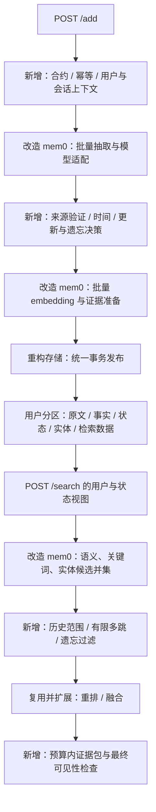

> 设计基线（实施前记录）。实际代码和验证进展见 [实施状态](IMPLEMENTATION-STATUS.md)；实施差异见 [实施决策](IMPLEMENTATION-DECISIONS.md)。

# 内核改造与来源说明

状态：已确定技术路线，完成关键路径静态审查，尚未迁入源码或开始实现。日期：2026-09-05。

本文保留实施前的方案和上游审查事实；其中的目标目录属于当时设计。当前模块目录及已实施映射见 [服务 README](../service/README.md) 与 [来源说明](../service/UPSTREAM.md)。

## 1. 路线决定

以 **mem0 的 TypeScript 开源内核为源码基础，进行有来源记录的裁剪与重构**。将其中可复用的实现迁入 `agent-memory-service`，建立自己的记忆领域模型、事务边界和检索编排。

最终的 `/add` 与 `/search` 调用本项目的写入/检索流程，各阶段使用改造后的 mem0 组件。顶层 `Memory.add/search` 只用于原版对照基线，不作为最终服务的黑盒实现。三仓库结构保持不变。

复用应落实到可运行的源代码、测试和明确的上游映射；仅看完 mem0 后重新写全部模块，不能算完成本方案的源码复用目标。也不以改动行数或复用百分比作为质量指标。

原方案的三层证据模型、生命周期语义和验收标准继续有效；存储统一事务仍是目标，但实现从 mem0 已有 SQLite 向量、历史和过滤代码出发演进。

## 2. 固定基础版本与审查范围

基础仓库：[mem0ai/mem0](https://github.com/mem0ai/mem0)。本次实际检出的 commit：

`dae67f74f5cc7bf138c7d7d6f9cec5ce4b4373b3`

核心路径为 `mem0-ts/src/oss/src/`，不是云平台客户端。静态审查覆盖 memory 编排、抽取 prompt/schema、评分函数、SQLite 向量与历史实现、模型接口、默认配置及实体工具相关代码；未对全部 provider 实现做运行验证。

来源文件校验和见 [upstream-source-manifest.json](upstream-source-manifest.json)。此 commit 是可复现的初始基线，不代表其部署默认值或所有功能自动适合赛题。

## 3. 源码中确认的适配差异

| 源码观察 | 对赛题的影响 | 对应改造 |
| --- | --- | --- |
| `addToVectorStore` 使用 ADD-only 批量抽取，显式 update/delete 是另一条调用路径 | 对话里的更新/遗忘不能仅靠顶层接口名称视为已实现 | 在抽取后增加目标绑定和状态决策 |
| `Memory.add` 对传入 `config.timestamp` 抛错 | 不能把消息时间简单透传成该参数 | 新建逐消息时间模型与 Session time 解析 |
| 写入流程生成抽取 prompt 时未传 observationDate，生成器会默认使用当前日期；prompt 要求相对时间标准化 | 历史对话可能锚定错误，原始表达还可能丢失 | 显式注入会话锚点，保留原表达与标准化区间 |
| 向量、历史、实体关联分别持久化；若干失败路径记录日志后继续 | 外层 await 不能证明整次请求原子完成 | 写入准备与事务提交分离，核心失败回滚 |
| search 的最终候选由 semanticResults 构成，关键词和实体分数主要为其加分 | 仅词法命中但不在语义候选中的证据可能丢失 | 改为多路候选 ID 并集，再做统一排序 |
| scoreAndRank 在融合前按语义阈值过滤 | 精确姓名/编号命中可能被语义阈值拒绝 | 各召回路独立资格，融合后评估相关性 |
| SQLiteManager 的 messages 用于保留最近 10 条上下文 | 它不是完整的来源证据仓库 | 新增完整消息、片段来源及派生依赖 |

调用链依据：[memory/index.ts](https://github.com/mem0ai/mem0/blob/dae67f74f5cc7bf138c7d7d6f9cec5ce4b4373b3/mem0-ts/src/oss/src/memory/index.ts)。时间提示与输出结构依据：[prompts/index.ts](https://github.com/mem0ai/mem0/blob/dae67f74f5cc7bf138c7d7d6f9cec5ce4b4373b3/mem0-ts/src/oss/src/prompts/index.ts)。评分依据：[scoring.ts](https://github.com/mem0ai/mem0/blob/dae67f74f5cc7bf138c7d7d6f9cec5ce4b4373b3/mem0-ts/src/oss/src/utils/scoring.ts)。上下文存储依据：[SQLiteManager.ts](https://github.com/mem0ai/mem0/blob/dae67f74f5cc7bf138c7d7d6f9cec5ce4b4373b3/mem0-ts/src/oss/src/storage/SQLiteManager.ts)。

以上是该 commit 的具体行为，不应扩展成所有 mem0 版本或托管平台的结论。历史源码中的 UPDATE/DELETE prompt 仍然存在，不说明当前主写入路径会调用它。

## 4. 保留、改造、新增清单

| 模块 | 上游路径（相对 OSS src） | 处置 | 本项目落点 |
| --- | --- | --- | --- |
| LLM provider | `llms/base.ts`、`llms/openai.ts` 及所需本地 provider | 迁入必要实现，保留协议映射；补 deadline、取消和严格返回类型 | `models/` |
| Embedding provider | `embeddings/base.ts` 及选用 provider | 复用 embed/embedBatch 和 action 区分，新增模型空间版本及维度校验 | `models/` |
| Reranker | `rerankers/base.ts` 及选用实现 | 按实际资源迁入，保留无 reranker 回退 | `retrieval/rerank/` |
| 结构化抽取 | `prompts/index.ts`、memory 中批处理逻辑 | 保留上下文组织、批处理与角色识别基础；扩展为带来源和状态的输出 | `extraction/` |
| 实体与文本处理 | `utils/entity_extraction.ts`、`lemmatization.ts` | 保留英文能力，补中文、别名及说话者绑定 | `extraction/entities/` |
| 检索评分 | `utils/scoring.ts`、search 中各路打分 | 保留原算法作对照，新增候选并集与 RRF 等融合策略 | `retrieval/fusion/` |
| SQLite 向量实现 | `vector_stores/memory.ts` | 复用向量读写/计算思路及相关测试，改成用户分区、共享事务与 Worker | `storage/sqlite/` |
| 历史与尾部上下文 | `storage/SQLiteManager.ts` | 迁移可用 SQL/批处理实现，扩展完整来源、操作记录，保留尾部上下文视图 | `storage/sqlite/` |
| 单体 Memory 类 | `memory/index.ts` | 拆解为多个内部组件，不保留其顶层控制权 | `application/` |
| 原子事实状态机 | 无直接等价模块 | 新增主体/槽位/作用域/有效时间/纠正关系 | `domain/lifecycle/` |
| 遗忘依赖处理 | 原有 delete 与实体清理仅作参考 | 新增目标解析、片段屏蔽、派生失效及重放保护 | `domain/forget/` |
| 三接口与幂等 | 不沿用通用 SDK 外部 API | 新增赛题契约、回显、request_id 回执 | `api/`、`application/` |
| 全程来源证据 | 上游文本 payload 作为起点 | 新增消息 ID、source span、完整证据包 | `domain/evidence/` |
| 通用平台功能 | cloud client、全部 provider 工厂、推广提示等 | 不进入交付的必要依赖；只保留选用模块 | 不迁入运行路径 |

模型适配器也不是不经审查直接复制。现有接口中的 `any`、自动默认模型、重试、网络请求和错误处理都要经过 strict 类型与资源约束检查。能够复用的旧测试应保留并迁移；不能用同名接口作为功能等价的证明。

## 5. 改造后的执行架构

关键内部结构为 `ExtractionBatch`、`MutationPlan`、`RetrievalCandidate`、`EvidenceBundle`。

`MutationPlan` 列出当前请求的新增事实、失效关系、遗忘范围、索引变更和幂等回执。模型只能产生候选；应用层验证来源与用户归属后决定事务操作，禁止让模型直接执行任意 memory ID 的删除。

增强后的候选结构保留 `semanticRank / lexicalRank / entityRank / sources / lifecycle / time`。融合函数可以比较“原版加权评分”和“候选并集 + RRF”，但已遗忘内容和无效当前态必须在排序前后被规则排除，不能靠降分保证不泄漏。

## 6. 存储重构必须动到内部

mem0 现有向量存储和历史管理各自创建数据库连接，实体存储也有独立初始化。仅把它们的路径改为同一文件，不能保证一次事务覆盖所有写入。

改造步骤：

1. 由用户存储单元拥有 SQLite 连接，各 repository 接收同一事务上下文；模型调用都在事务外。
2. 原文、事实状态、词法/向量数据、实体依赖和 request_id 回执在一次事务中发布。
3. 复用上游的向量/关键词与过滤实现建立基线，再通过测量决定何时用 FTS5 替换全量词法扫描；API 与事务语义不随索引实现变化。
4. 原版 SQLite 删除历史可能保存 previous_value；遗忘实现不能将其当作可返回的历史证据。完整来源与历史的可见性采用统一策略。
5. 将同步 SQLite 操作与向量计算移入 Worker，并把上游任何可选的 best-effort 增强与核心必须成功的操作分开。

这会改变上游存储内部，但避免同时重写成熟的模型通信和所有检索工具。

## 7. 证明改造价值的实验

保持同一数据划分、Answer、Judge、模型和预算，设置：

| 配置 | 含义 | 目的 |
| --- | --- | --- |
| U0 | 原版 mem0 固定 commit + 最小测试适配器 | 保留真实上游参照；不作为最终交付架构 |
| U1 | 源码迁入、模块拆分，保留原算法 | 验证裁剪/重构未意外破坏原有能力 |
| U2 | U1 + 严格事务、来源、时间和生命周期 | 验证赛题必需能力与状态污染改善 |
| U3 | U2 + 候选并集、多跳、证据预算 | 验证检索改造的实际增益 |

U0 的输入转换及不支持功能必须明确记录；不支持 timestamp 时不能伪称已透传。对照适配器可位于 service 的测试构建目标，由 eval 仍通过 HTTP 调用；生产镜像只启用改造内核。

增加有针对性的回归：关键词唯一命中未进入语义候选；抽取 JSON 不合法；批量插入失败；history/entity 写入失败；历史会话时间；原始相对时间保留；关系撤销与内容遗忘；旧请求重放；所有召回路的用户隔离。

任何“更高分、更快、更省”都在运行 U0–U3 后再判断。当前只有代码审查依据，没有这些实测结论。

## 8. 工程实施顺序与来源管理

第一步冻结上游 commit 和所需文件映射，迁入最小可运行子集及其测试；在功能不变的基线上验证类型检查和构建。第二步拆分编排并收拢存储事务。第三步增加生命周期与时间能力。第四步通过消融决定保留哪些检索增强。

service 独立维护 Git 历史；可通过一次注明来源的源码导入建立可追溯基线，不要求额外增加第四个运行仓库。保存 `UPSTREAM.md`、源文件 hash、迁入/修改清单及相应版权和许可文件，后续按需选择性移植上游修复，不自动合并浮动 main。

本次观察到根目录 LICENSE 与嵌套 OSS package.json 的许可标签不同；迁入时保留各自原始声明并核对适用文件，不擅自把全部来源重新标成单一许可。此处记录的是源仓库元数据差异。

既有“完整自建”路线现改为源码级复用；模型适配器版本、Zod/Ajv 边界、编译器及测试工具需按所选源码依赖重新联调，前版版本表仅作为候选清单。
