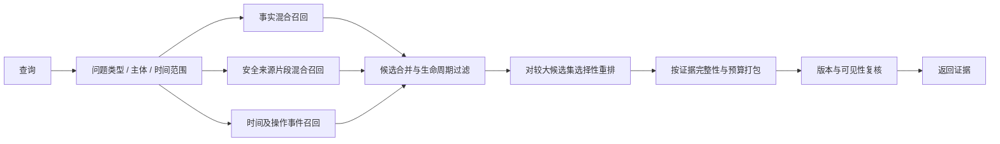

# 第二轮改进方案：先恢复可信的记忆语义，再改证据选择

2026-09-05。本方案基于已经交付的冻结版本和保存结果，仅新增分析、复现探针与方案；没有改动服务、模型、原始答案或历史成绩。服务基线为`842b130`（生产源码与`910b3dd`一致），评测基线为`8f5be51`。下一轮建立新实验版本，保留原交付包。

建议顺序：**判分校准与生命周期修复并行 → 原文/事实双路召回和正确位置的重排 → 时间与操作事件视图 → 条件化关系扩展与成本优化**。第一轮优先解决能确定复现的错误，再验证组件收益。

## 1. 当前证据说明了什么

| 观察 | 解释与限制 | 对应动作 |
|---|---|---|
| 主成绩331/1000，MemOps有36题因4次写入拒绝未判定 | 即使修复后36题全部答对、其它题不变，总分也最多到36.7%；这是上限而非收益预测 | 修复可用性，同时改善已成功请求的记忆质量 |
| 相同MemOps保存答案：代理175/464，上游348/464；175条判定不同 | 这里使用相同464题分母；不能把主成绩175/500直接与348/464解释成模型能力变化 | 建立判分校准集，保留两种协议 |
| B1开发集LoCoMo18/30、MemOps20/30；U3为17/30、12/30 | 仅2个LoCoMo对话、3个MemOps背景，且存在运行错误与重复推理波动；不证明简单方案普遍更好 | 把保留原文的方案作为质量对照，验证复杂组件是否损失证据 |
| no_hop的MemOps为19/30，U3为12/30 | 小样本关联，不能把7题差异全部归因于多跳；其中有判分失败，且重复运行存在波动 | 验证按问题启用关系扩展，而非默认全量扩展 |
| LoCoMo时序9/148；MemOps OperationTrace8/104、StateTrajectory3/21 | 当前主协议下明显弱项，不能只靠总体正确率解释 | 时间、操作过程分别设计证据视图 |
| LoCoMo498题有来源标注，全部来源ID覆盖约36.9% | 来源ID命中不等于语义蕴含，也不能直接区分未提取、未召回和被预算淘汰 | 记录召回各阶段的候选流失 |

基础结果见[交付报告](../reports/DELIVERY-REPORT.md)、[开发对照](../reports/development-final-comparison.json)和[最终诊断](../reports/holdout-v2-final-diagnostics.json)。自动错题分类只作为线索，不能直接视为确定因果。

## 2. 本次新发现：比“4次写入报错”更需要优先处理

### 2.1 删除意图被规则拒绝，降级后删除操作消失

对现有`Extractor.prepare`使用固定模型桩，模型始终提出来源正确、目标ID存在的删除操作。探针没有联网或写数据库：

| 用户表达 | 返回的删除操作 | 降级 |
|---|---:|---|
| `Forget the Acme quote entirely.` | 1 | 无 |
| `Please forget the Acme quote entirely.` | 1 | 无 |
| `You can forget the Acme quote entirely.` | 0 | extraction_offline |
| `I do not need the Acme quote stored anymore.` | 0 | extraction_offline |
| `Do not forget the Acme quote.` | 0 | extraction_offline；保留是正确行为 |

现有`realControl`主要识别有限句式；模型删除提案被拒绝后，再次修正仍失败会进入离线提取，而离线提取使用同一识别逻辑。因此，即使模型已经识别了意图，规则也可能将它丢掉。提取器返回了可提交、没有删除操作的结果；该探针没有调用HTTP，不把它描述成一次真实HTTP成功请求。

这不是要求删除必须宽松匹配。正向表达、否定、引用、假设、第三方发言必须同时验证；不能通过取消意图校验解决问题。

复现：`node scripts/probes/forget-intent.mjs`（在已构建的工作区根目录、Node24环境执行）。[结果](../reports/improvement-intent-probe.json)记录源码及探针哈希。该实验复现机制，历史请求的原始模型输出未记录，不能据此断言历史失败经历了完全相同的提取过程。

### 2.2 已确认的服务返回泄漏，以及两种Judge各自的反例

抽查保存结果发现三个具体问题，见[人工定向核查](../reports/improvement-manual-case-audit.json)：

- `C01_forget...p3_state_transition...`：答案和7条返回证据中仍出现rubric明确禁止的旧报价公司名或金额。上游却给出`answer_score=1, leakage=0`。这是已观察到的服务返回内容问题，不能解释为仅仅判分太严格；也不能以该答案层标记推断数据库已经正确删除。
- `D19_update...p5_operation_application...`：题目要求三项存储配置，答案明确不知道其中的本地硬盘信息。上游理由承认缺失，但仍给1分。需要复核这种理由和标签矛盾。
- `E15_reflect...p4_candidate_disambiguation...`：答案在空白归一化后与参考答案完全相同，代理仍以“没有选择选项或其改写”判错。

这三个样例是定向分析，不是随机抽样，不能估计全体误判率。本轮464条上游结果没有发现后处理将原始分数改写的记录；不能把全部分歧归咎于上游显式分数修正规则。模型、提示词、评分输入和解释边界仍需分开核验。

## 3. P0：评分可信度与生命周期修复并行

### A. 固定评分协议并校准

在`eval`建立独立版本的校准集，覆盖六类MemOps题型，包含完全正确、缺关键事实、合理改写、无关多说、旧值错误和遗忘泄漏。先由人工依据问题和rubric给出判断依据，再比较代理与固定上游结果。优先复核175条分歧，但也抽查两者一致的样本，避免共同错误被忽略。

对编号、金额等明确禁止字面值增加独立扫描，用于发现“泄漏=0但字符串实际存在”的矛盾；语义性禁项和必要的历史描述不能直接交给字符串扫描判总分。答案正确性、泄漏、误遗忘、旧值、过程证据分别报告。

新的校准Judge使用新协议ID，与原代理并列，不覆盖33.1%的历史记录。正式配置可用后按其要求重跑所有对照；在此之前固定Answer及每组比较的Judge、模型、预算和采样参数。[MemOps上游](https://github.com/MemTensor/MemOps)本身区分问答与生命周期诊断，二者不应混成一个分数。

**验收**：三个已确认反例获得与依据一致的处理；新增人工校准样本报告逐类误判和分歧，不通过选择更宽松的Judge制造提升。判断标准先于候选评测固定。

### B. 把操作意图、目标解析与事务提交分开

建议写入流程为：

具体改动位置：`service/src/extraction.ts`、`types.ts`、`storage.ts`、`engine.ts`。

1. **意图识别独立输出**：记录是否存在生命周期指令、来源位置、作用对象、否定/引用/条件和不确定性。对“规则与模型不一致”做有界核验，不自动转成“没有操作”。同一段中其它引语不应一概否定独立的真实删除指令。
2. **服务负责最终绑定**：模型提出主体、属性、范围、值及候选句柄，服务验证并解析为内部ID。现有候选仅按词面选120条，修复时还应区分“目标不在候选里”和“目标确实不存在”，必要时在该租户内按主体/属性扩展候选。
3. **支持同chunk引用**：为新事实使用明确的临时句柄，例如`new:0`，只允许引用时间上已经出现的事实。服务统一生成持久ID，处理当前要求模型只能使用已有ID所覆盖不足的情况。
4. **按错误定向修复**：区分不存在ID、范围不一致、多候选歧义、已删除目标和未入库的被否定声明；保留有根据的提案，只修复出错的部分，统一受原请求超时约束。
5. **保留原子性和真实成功语义**：所有决定在提交前完成。无法确认的真实遗忘指令仍应明确失败；不能静默跳过后返回成功。只有能证明是未曾存储的被否定声明、已满足的同边界删除等情形，才允许有依据的no-op。可选反思提案的降级与必须完成的操作分开。
6. **增加内部诊断**：错误类型、候选数、候选ID、解析结果、修复次数、降级原因和阶段耗时。生产日志避免存储被遗忘值和完整对话；开发复现场景使用单独、受控的数据和日志。

**验收**：复现4次拒绝所需的输入前缀并制作新的合成变体；明确删除、否定、引语、同chunk创建后撤销、重复删除、跨scope同值和邻居保留都要覆盖。已知有效操作不得被静默丢弃；歧义指令不得误删。继续通过原有同步、事务、崩溃、幂等和隔离检查。HTTP失败率和静默漏执行率分别报告。

### C. 将删除范围与来源片段绑定

已有删除标记与依赖传播应保留。新增覆盖“实体报价”“同一实体的金额/公司/时间分散在多条事实”“删除指令自身包含旧值”的场景。原文、事实、向量、事件、重排输入及最终打包共享同一个可见性决策。

逐步引入来源片段位置与事实关系，避免整条消息因一个属性失效而丢掉无关事实，也避免全局同值匹配误伤其它scope。原始对话索引必须提供经过删除处理的视图；不能借补召回来恢复已忘内容。遗忘事件只保留允许的操作类型、对象类别和时间等元数据，不保留被禁止的值。

**验收**：在新的、人工核对过的遗忘用例中，检查事实、来源片段、各召回路径、缓存及并发重排的结果；明确要求保留的邻居也必须可检索。答案泄漏率与实际返回证据泄漏率独立统计。

## 4. P1：让有用证据进入候选，再进行重排和预算选择

### 已确认的实现瓶颈

- `retrieve()`先按数量和上下文预算打包，`Engine.searchImpl()`再重排。补查Worker调用确认：启用重排时内部配置扩大到最多64条、18000 token，但仍受请求top_k限制（top_k=32时仍最多32条），随后Engine才裁至最终32条/6000 token。重排只能改变已选证据顺序，不能找回此前丢掉的候选；当前收益不应被当作完整reranker方案的上限。
- 原文补召回主要使用词面重合，门槛0.2，较低固定分数，长于2500字符的消息被排除。它不等价于B1对原文做向量检索。
- `list`意图虽被计算，当前没有用于列表覆盖式打包；来源上下文按第一次入选的事实消耗预算，可能影响后续同来源事实的证据呈现。
- 两跳扩展本质是实体共现扩展，种子6条、总扩展40条，并非经过关系类型和方向验证的推理图。

### 建议结构

保留“原文片段 + 原子事实”两种视图：事实用于当前状态、更新和精确绑定，来源用于细节、人物及跨句支持。两者共用来源ID、状态和删除边界。不能直接把没有生命周期能力的B1替代成参赛服务。

先固定最终32条/6000 token，把内部候选池100/200、重排输入40/80作为待测配置。重排使用紧凑候选，最终才扩充必要上下文；不把增加最终上下文预算与重排收益混在一次实验里。列表按不同条目覆盖，时间题按事件与锚点覆盖，优先避免大量近重复事实挤占预算。

调试记录区分：未入库、被生命周期过滤、各路未召回、重排淘汰、预算淘汰。gold只由独立诊断器对保存阶段记录做事后比对，服务及普通Answer输入不增加gold字段。阶段覆盖仍是来源标记诊断，需要抽查语义支持。

关系扩展改为受控分支：只在多实体、多跳或初次证据不足时尝试；依据主体、关系和时间限制扩展。先比较关闭、当前共现扩展、条件扩展三组，不能据旧开发集的一次差值直接宣布应该永久关闭。

**验收**：固定终端预算、Answer和Judge，比较B1、当前U3、双路候选、前置重排、覆盖打包的逐题变化；同时检查新增证据是否引入旧值和泄漏。更高来源覆盖本身不是验收完成，必须报告答案质量与负例表现。

## 5. P2：显式时间和操作事件证据

时间问题需要区分消息观察时间、事件发生时间、有效区间和时间精度。当前代码可保存`valid_from`，但返回内容主要暴露观察时间、原始时间表达和状态，未完整呈现有效区间；这可能让固定Answer重复做日期解释。该路径是待验证原因，不能归因全部139道时序错题。

在写入时把可唯一确定的相对日期规范化，并同时保留原表达、锚点和精度；月/年信息保持区间，不能补造具体日。MemOps外层合成排序时间继续只作顺序，不能变成事件日期。主体解析同样保留原说话人和来源，不在引用原文内改写代词。

增加安全的事件投影：remember/update/correct/retract/forget/restore及有来源的reflection，记录操作对象、事件顺序、状态变更和允许的来源引用。当前已有操作表及部分forget/retract提示事实，应在其上补足可检索视图，不另建不受删除约束的历史库。普通历史问题可以看到合法旧状态；被要求遗忘的值不能因“历史查询”重新出现。

查询计划至少区分当前状态、历史状态、列表、操作过程与轨迹；当前主要依赖少量正则。输出仍是有来源的事件证据，不生成最终答案、不返回推测过程。

**验收**：覆盖相对日期、跨chunk锚点、计划未落实、事后叙述、纠错与真实历史的区别；轨迹检验中间状态、顺序、最终状态和删除边界。使用保持不变的Answer验证证据呈现是否真正改善问答。

## 6. 实施拆分与实验顺序

| 批次 | 主要改动 | 交付与决策依据 |
|---|---|---|
| E0 | Judge校准、失败链路诊断、阶段观测 | 可复核的评分配置和错误类型；与服务修复并行 |
| E1 | 删除意图、降级语义、目标绑定、片段可见性 | 已知反例及新变体通过；零静默漏执行的限定用例集；不放宽隔离或原子性 |
| E2 | 安全原文混合召回 | 同预算比较是否恢复细节，同时满足生命周期检查 |
| E3 | 重排移到最终打包之前，列表/来源覆盖 | 用逐题变化和阶段淘汰定位收益，不只看汇总分 |
| E4 | 时间规范化、完整事件投影 | 时序与过程题专项提升，普通单跳不出现明显退化 |
| E5 | 条件关系扩展、选择性重排及调用量优化 | 质量和生命周期指标无明确恶化，再比较成本与时延 |

`service`负责语义、存储与检索；`eval`负责协议、校准、题目及统计；总控仓库只固定实验配置、版本与报告。继续以HTTP和静态契约分离三仓库，不把诊断读取数据库的能力塞进普通评测器。

每个结构变更使用新数据目录，防止旧向量、删除标记和来源格式混用。纯检索变更可在版本匹配的同一灌入快照上对照，写入/生命周期变更必须重新灌入。保留当前服务和交付包作为可回退基线。

## 7. 避免在已看过的保留集上制造“提升”

- 本次500+500保留集已查看答案并据其诊断，应降为固定回归集；后续提升只能称回归改善。
- LoCoMo现有10个对话都已经用于开发或保留集，重新划分不能创造未见测试。分组交叉验证只衡量稳定性；真正确认泛化需要额外未用于设计的新对话或正式隐藏集。
- MemOps先审计全部历史运行的背景曝光，再从未使用的背景选取新验证数据；不足时准备新背景，并在开发前封存其题目和答案。相同背景的变体不得跨分区。
- 探索阶段用100–200题的小批次控制成本，对入围配置做至少3次独立推理重复；按对话/背景报告配对变化和重采样区间，不把同背景题目视为独立样本。确认阶段依据观察到的方差决定样本量，不保证任意固定题数都具有统计功效。
- 原始失败保留在计划分母；记录所有配置，避免只汇报最好一次。服务优化不能通过改固定Answer、给模型gold或删除失败题提高分数。

## 8. 成本和预期

当前增强保留集服务记录约3,123万token，成功写入中有115次降级事件。先区分“无需模型的确定性路径”“必须澄清的操作”“需要重排的检索”；更换更大模型应留到管线问题排除之后，以相同输入做小规模对照。仅提升结构化JSON格式约束不能证明目标语义正确，网关是否支持更严格schema也需独立验证。

优先解决质量和语义：离线5000事实/16并发搜索p95约221ms，而真实增强搜索p95约17–20秒，当前证据没有支持立即替换SQLite或扩展成分布式系统。后续测量单独归因模型、目标检索、重排、Worker等待与打包，保留实际模型调用量。

**不承诺未经验证的目标准确率。** 写入恢复最多贡献3.6个总分百分点；主要提升空间来自操作正确执行、保留必要证据、时间/过程表达与可靠判分。每个收益必须在固定协议和新验证数据上分别证实。

参考：固定版本[MemOps评价实现](https://github.com/MemTensor/MemOps/blob/312af65e2c7b6d1b70f062ffa8b4cde32aaf6f35/5.5-evaluate_operation_metrics.py)、[LoCoMo Refined](https://github.com/mem-eval-suite/LoCoMo_refined)。本地上游文件哈希和所有原实验协议保留；本方案不修改上游评价逻辑来回填历史成绩。
