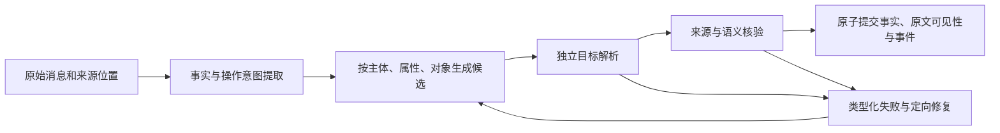

# 目标绑定与定向修复：真实失败驱动的下一阶段设计

状态：设计待实施。证据为第二轮四个原始失败前缀，均属于已曝光回归数据。本文不表示对应模块已完成。

当前核心问题是提取器同时负责“识别发生了什么”与“决定修改哪一条记录”。当不存在对应旧记录时，模型会把纠错绑定到可见但无关的m0；属性守卫可以阻止破坏，但整份JSON重生成仍可能重复相同错误。来源引用、同chunk顺序与删除范围又混在同一次生成中，使修复容易互相干扰。

## 需要改变的边界

1. **提取阶段不直接授予数据库修改权。** 操作意图包含动作、人物、对象、属性、范围和精确来源；在目标解析完成前，模型生成的ID只是候选建议。避免把“可见第一条记录”隐式当作默认目标。
2. **目标解析返回明确结果。** `resolved`给出租户内实际目标及逐目标依据；`unrecorded_correction`只适用于已证明为未入库助手错误的纠正，保留有用户原文支持的新事实；`ambiguous`、`missing_evidence`继续修复或拒绝。不得把所有找不到目标的forget都变为成功no-op。
3. **候选扩展按真实意图触发。** 首先查主体/属性/实体，必要时扩展词法与向量候选；只把确实相关的事实和原文送给绑定器。原文尚未形成事实时需要创建可追溯的来源目标，不能用一个experience大桶代替。扩展受统一请求预算与最大次数限制。
4. **稳定同chunk句柄。** 新事实句柄在拆分与修复中保持稳定，只有先于操作的来源可被绑定。修复不能重排数组后把new:N指向别的事实；未知/未来引用是类型化错误。
5. **定向修复不重生成无关内容。** 分开修复来源位置、候选引用、范围与遗漏事实。已验证的事实保持不变；修改的事实、依赖及操作再核验。核验格式错误可以有限重试，语义失败不能靠反复重判取通过结果。
6. **语义核验覆盖每条新事实。** 除已有的操作与消息覆盖检查，还要验证新事实是否由用户原文支持、是否把计划当已发生、是否把泛泛问题当个人属性。来源出现了同一个词不构成语义支持。

## 四个失败的验收边界

| 前缀 | 必须验证的实际状态 |
|---|---|
| D24_reflect | 无关投资计划保持原样；Outback的开放感/窗户及RAV4压抑感保留为有用户来源的事实；被否定的AWD主因不作为当前原因返回 |
| E03_reflect | 跨段人物、组织、交接和反思来源完整；未知new:N不静默丢弃；保留合法事件历史 |
| C30_update | auto-invest的旧/新金额、标的及相关转移事件分别正确；旅行计划不能挤掉前面的金融信息；真实历史不被纠错删除 |
| D17_remember | 平板及同步问题退出所有返回路径；工作电脑Firefox、手机Safari及其他人的Brave信息仍按各自主体/设备保留；不能删除整个experience属性 |

每个前缀需要原始HTTP重放、实际持久状态、当前/历史/操作查询及原文可见性证据。补充否定、引用、换主体、同值不同设备、未入库目标及多指令变体。HTTP成功率、语义状态通过率、离线降级率、模型调用次数与p95延迟分开报告。

## 发布与评测门槛

保留所有失败运行及源码hash。四前缀和变体未通过时不以80项单元测试作为上线依据，也不更新整体准确率。通过后冻结服务/提取模型/Answer/Judge及预算，在曝光审计之外选择新背景组；同一组输入做至少三次完整配对运行，分别测量写入、召回、最终回答和成本。条件扩展与选择性重排再按消融结果决定是否启用。

## 本轮对照新增约束

D24同源码下，gpt-5.5通过写入、持久状态及两次真实问答，mini在目标绑定处失败；同时总写入约81秒对36秒。E03/D17仍触及80秒模型预算，C30降级仍留有错误当前状态。这说明模型选择值得纳入消融，但不能替代绑定与修复架构。

后续可比较“主提取mini、困难绑定或定向修复使用更强模型”与统一模型方案；模型路由必须显式记录，不能把升级模型的收益归为纯代码收益。先去掉重复生成整份提案的成本，保留相同接口时限；核验输入压缩须保留实际说话人、照应上下文与来源支持，不能为压缩token删掉决定授权的上下文。
