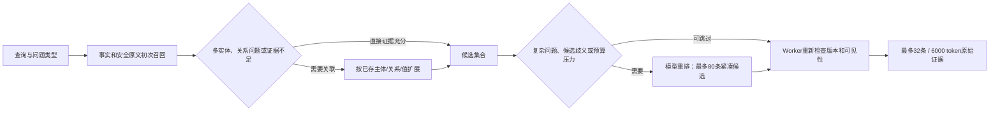

# 查询策略与重排协议（E5）

服务检查点 `0ad738e` 实现条件关系扩展、选择性重排与整数索引重排协议。它是待做完整质量比较的实验候选；不能以合成控制结果宣称正式准确率或通用成本收益。

## 查询分支

问题类型来自有限规则，词面覆盖率只是选择分支的启发值，不是语义置信度。修正了旧列表正则把“What is my browser?”误判成列表的问题；明确列表、复数对象、时间、操作和轨迹问题仍保留相应分支。

条件扩展只沿已存的主体、关系属性和值寻找连接。支持的关系族包括朋友、经理、同事、亲属、伴侣、雇主和所在地等；任意实体共现不成为连接依据。仅使用已通过生命周期过滤、有来源且模态为confirmed的事实；conflicted、hypothetical、erased和retracted记录不能作为连接。已知有效区间在路径上取交集，不把互不重叠的历史关系拼接。最多展开两层目标节点、24个节点、每节点8条、总40条事实。返回已有证据，不创建“推理得到的新事实”或最终答案。

选择性重排在Worker提供候选时决定。复杂问题保留模型分支；简单查询在全部紧凑候选估算可装入预算、或明确主体的直接匹配领先时可以跳过。任何分支仍经过同一最终打包和版本检查；重排期间发生删除，旧评分被丢弃并重新读取安全证据。非法输出或12秒重排调用失败时使用确定性召回，并记录fallback，不把失败隐藏成模型成功。

## 参数和对照

| 参数 | 默认 | 实验选项 |
|---|---|---|
| MEMORY_RELATION_MODE | cooccurrence | off / cooccurrence / conditional；仍受hybrid与MULTI_HOP总开关约束 |
| MEMORY_RERANK_POLICY | always | always / selective；仍需启用RERANK和enhanced模式 |
| MEMORY_RERANK_FORMAT | ids | ids / indices；不改变12秒调用预算 |

[实验配置](../configs/round2-query-policy.json)分别保留无关系扩展、旧共现、条件扩展、选择性重排、无扩展的选择性重排及旧ID协议控制。主比较使用相同整数协议、终端预算和固定Answer/Judge。总控的灌入复用检查只将这三个参数视为检索配置，仍拒绝不同源码版本、写入设置、数据集、未结束或不完整灌入。

整数协议把本次候选映射到服务器生成的slot，模型只返回`[slot,score]`。服务器依据同一次候选数组恢复持久ID，拒绝越界、重复、非整数、非有限分数或越界分数。原始正文与时间/主体元数据均保留；压缩的是标识符传输。候选版本改变时不能复用旧slot所解析的评分。

诊断日志记录query/tenant哈希、条件扩展原因与命中ID、重排启用原因、成功/回退、调用时间和旧评分是否被丢弃，不记录查询或证据正文。私人模型trace只在明确启用的开发目录保存。

## 当前证据

[复核报告](../reports/round2-query-policy-review.json)保留全部成功、失败和未知usage。

| 对照 | 结果 | 解释边界 |
|---|---|---|
| 初版ID协议HTTP控制 | 两组各6道控制题均命中必要词，但共6次重排超时 | 不以回退后的答对宣称重排有效 |
| 固定候选协议对照 | ID完成2/6，整数完成6/6；中位耗时约12.01秒与3.79秒 | 两个合成候选包，每包三次阶段重复；整数还发生1次连接重试，不是三次完整基准重复 |
| 最终整数协议HTTP控制 | always和selective各6题检查通过，8次实际重排均成功，数据库均未变化 | 只有9条合成种子事实，不是拥挤候选或未见背景 |
| 调用与延迟 | always重排6次、11668报告token、中位搜索3.62秒；selective重排2次、3851报告token、中位搜索0.107秒 | 仅这六个控制查询；不含Answer/embedding成本，不估算费用或推断通用节省比例 |

两次HTTP控制的12个回答分别复核了本人Firefox、蓝色、黑滴滤咖啡、Bob划艇、雇主所在地Oslo、Alice绘画与Bob划艇，没有观察到主体交换。该复核是助手检查，不是独立人工或正式Judge。种子由确定性事实提案生成，使用真实本地向量；检索、重排和固定mini Answer是真实调用。

[247项服务测试](../reports/round2-query-policy-service-tests.txt)与构建通过，新增专项11项，覆盖条件分支、方向/关系族、时间相交、删除与未决过滤、节点与证据上限、模型跳过/调用、非法输出回退、slot完整性及并发删除后的旧评分失效。灌入身份检查4项通过。

尚需完整背景上的off/cooccurrence/conditional比较、固定预算的逐题质量与生命周期检查、至少三个完整配对重复以及新背景验证。当前正在运行的91782c6五背景实验不包含本次E5改动，且E10第26段已经因写入失败终止该背景；不能据本文件启动部署或更新总体准确率。

预算分支使用紧凑候选的token估算；最终附加来源上下文可能增加长度，因此该启发式不保证所有原文细节都进入最终包。最终硬预算仍执行，拥挤候选与来源扩充后的淘汰情况需要在后续配对中专门验证。
