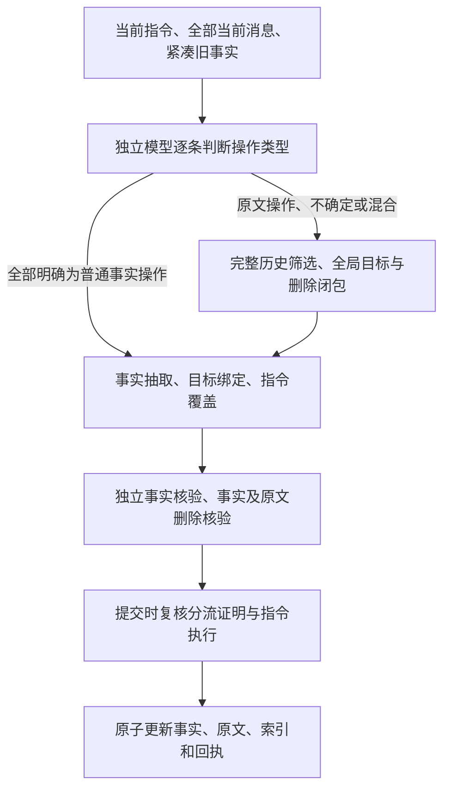

# 普通操作分流与写入检查

服务检查点 `6771326`，配置 `configs/round2-source-routing.json`。本轮解决普通事实遗忘在抽取之前扫描全部历史的问题。新参数 `MEMORY_SOURCE_OPERATION_ROUTING=true` 默认关闭，依赖完整历史分批及其全部前置配置，必须使用新 v9 目录。共享90秒模型预算、115秒HTTP预算和回答证据预算均不变。

## 流程与边界

分流模型使用verification模型，要求每条识别出的直接遗忘指令都有一行结果。普通操作必须引用当前用户原话，明确真实主体及操作对象；助手误述、含糊历史指代、争议归属及不确定情况进入完整来源核验。旧事实全部以紧凑字段提供，没有关键词截取历史替代核验；分流输入超过180000字符直接报容量错误。

分流引用可以包含同一条用户消息中紧跟命令的解释。例如“删除备用名字。我们已决定不需要备选。”要作为完整消息理解。该引用只解释操作类型；实际删除操作仍有独立的来源授权、目标绑定及先后顺序规则，分流不能创建或删除事实。来自后续另一条消息的引用不接受。

`route_review` 绑定当前请求、全部旧事实、完整历史身份、实际分流输入及协议 `source-route-v2`。准备与提交均检查指令完整性、唯一性、原话精确性、角色和身份变化。全部普通操作才免除前置历史筛选；混合请求仍执行完整 v8 核验，且普通操作不能被改为原文剪除。分流不抵消任何普通遗忘义务；提交时还会拒绝遗漏执行的遗忘指令。模型语义分类仍可能出错，这些结构检查不能代替真实语义质量评测。

原文核验提示另明确：初始目标只包含指令之前的助手断言；之后的道歉或回述只属于待删片段，不能再次列作初始目标。服务原有先后检查未放松。

## 验证与失败

- [服务测试](../reports/round2-source-routing-service-tests.txt)255项通过，[专项](../reports/round2-source-routing-targeted-tests.txt)8项通过。覆盖漏指令、重复、伪造/过期证明、混合请求完整核验、普通分流不能删除原文、未知目标不能用空操作成功、提交遗漏执行、事务回滚及目录格式隔离；模型阶段路由也已纳入原有协议测试。
- 初版 [8个真实分流控制](../reports/round2-source-routing-controls-w2DZde.json)全部符合事先写定的预期；最终版 [BkwZ38控制](../reports/round2-source-routing-controls-BkwZ38.json)同样8/8。这些是作者设计的路由控制，不是独立人工校准集、完整写入或基准准确率。
- 第一次[失败快照重放](../reports/round2-source-routing-replay-fDxfcC.json)：E10第26段准备成功，64.07秒，19条事实/1条操作，未降级。B05第18段因同消息解释引用超出命令句范围而被拒绝，4.05秒；据此修正分流引用边界，保留失败结果。
- 第二次[快照重放](../reports/round2-source-routing-replay-Ks3Yhn.json)：E10再次准备成功，86.27秒，24条事实/1条操作；B05已普通分流，抽取61.18秒后仍遇替换事实18/28/30的匹配问题，两次修复连接失败，77.26秒终止。没有降级成功或扩大预算。两次E10的输出数量与延迟有波动，不能把单次节省解读为稳定质量提升。
- 上述重放仅复制冻结v8数据库进行v9准备，数据库和格式均保持不变，没有v8→v9迁移或提交；不是原完整背景从空库灌入，也不能用于正式复用或配对成绩。
- 第一次[新目录HTTP控制](../reports/round2-source-routing-http-9cYOAU.json)普通遗忘写入成功，但模型将后续道歉也列作初始目标，第三次写入被拒绝。提示补充后，[最终HTTP控制](../reports/round2-source-routing-http-Eedfgp.json)三次真实add分别10.46、19.74、30.81秒，7/7检查通过：普通门禁码遗忘、助手误述及回述删除、兄弟同名健身房与浏览器保留、搜索与重开持久性。全部抽取/核验及本地embedding均真实调用；仍是小型合成背景。
- 初版[31.4万字符历史控制](../reports/round2-source-routing-history-Fz7J5r.json)在历史筛选连接失败，15.22秒终止，事务未变化。最终版本[独立新目录重试](../reports/round2-source-routing-history-bmceVF.json)60.01秒准备并提交成功，6/6检查通过，全部6批筛选/闭包均完成；种子仍是确定性构造，删除请求才真实调用模型。不丢弃失败或把传输重试当作独立完整基准重复。

所有探针均保留请求、源代码快照、配置hash和私有模型跟踪；公开于私有代码仓库的报告不包含API密钥。只按报告记录的源文件hash归属版本，不能把开发过程中较早的控制追认成最终服务版本。

## 下一步

B05未完成：复核发现提案18把chosen_first_name替换primary_name、提案28把name替换full_name、提案30把Violet这一具体名字的风格评价替换baby names的一般偏好。前两项需要判断属性同义/细化，后一项存在范围缩小后覆盖一般偏好的风险，不能统一放宽scope规则。区分绑定/替换事实语义错误与修复传输错误，先复核原始提案和修复反馈，再决定是否需要跨属性操作拆分或抽取协议优化。不能仅延长超时或增加无上限重试。新v9完整五背景从空库尚未通过；正在运行的91782c6五背景仍按原版本完成并保留全部失败题目。

E0独立评分校准、E1其余边界、E2–E5固定预算完整质量对照、新背景、至少三次完整配对重复和部署/独立归档继续开放。8088未更新；历史331/1000仍是已有总体基线，本轮没有新的总体准确率结论。

总复核：[版本与实验归属](../reports/round2-source-routing-review.json)。
