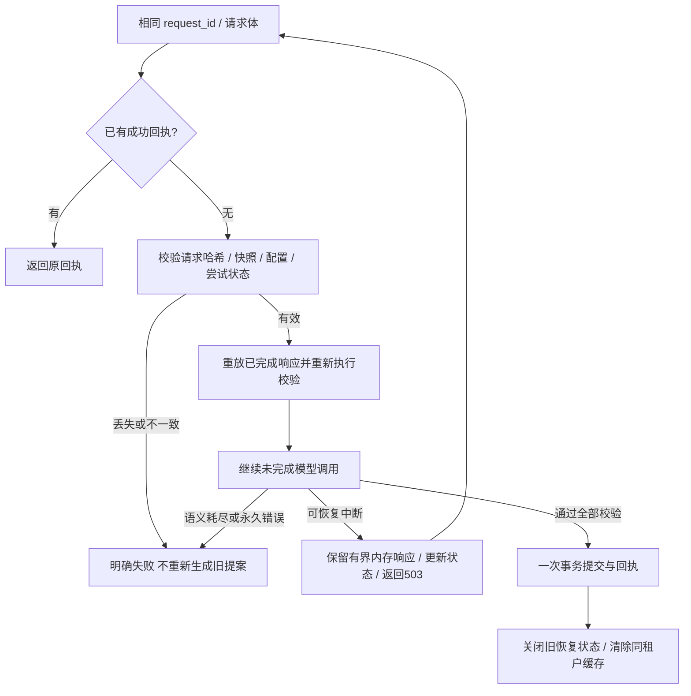

# 有界写入恢复与拒绝状态保留

## 当前实现

服务独立候选 **98c12e5** 新增 `MEMORY_WRITE_CONTINUATION=true` 实验开关，默认关闭。目标是让相同请求在传输中断后继续未完成的模型调用，同时保留原来所有已完成的模型决定，尤其是核验拒绝。不是每次HTTP失败都重新抽取并重新投票。

## 约束与数据边界

- 每个逻辑请求最多执行3次HTTP准备尝试；每次仍遵守原模型预算和HTTP截止时间。单个模型调用的传输尝试数、语义修复轮数不变。每次恢复会重新执行确定性流程和验证器，但已完成的模型响应按完整调用身份和调用序号重放。
- 缓存身份绑定请求体、完整快照、配置及进程；每个模型包进一步绑定system/input、上下文、模型路由、reasoning及格式配置。以前缓存的所有决定必须在恢复中被消费，否则不允许提交，不能绕过之前的拒绝。
- 仅SDK类型确认的瞬时错误、或内层模型截止时间允许待恢复状态。永久4xx、JSON/协议错误、耗尽的语义修复、缓存失效和外层调用取消都不能借此重新投票。启用此模式后，不允许把 `extraction_offline` 降级当作成功提交。
- 内存缓存最多32个请求、单请求8MiB、合计64MiB，缓存TTL从首次开始计5分钟，不因重试延长。过期/淘汰后不能用空缓存重新生成原请求。缓存TTL限制的是恢复缓存；执行中的工作仍受自己的请求信号约束，缓存失效后不得提交。
- SQLite的 `preparation_attempts` 仅保存请求ID哈希、请求体/上下文哈希、进程owner、次数、到期时间和状态，不保存提案、原文或模型响应。关闭状态保留为失败请求的元数据，避免重启或失去缓存后悄悄开始新投票；本实现不支持跨进程恢复响应。
- 相同ID换请求体仍返回 REQUEST_CONFLICT /409，并保留原待恢复缓存。其它不能恢复的情况返回 EVIDENCE_VALIDATION /503；可继续者返回 WRITE_CONTINUATION_PENDING /503，由调用方按原有界策略提交相同请求。
- 成功事务同时提交事实/来源/索引/回执、删除自身准备元数据并关闭其它旧状态。随后清除同租户缓存；其它租户不受影响。关闭实验开关也不能绕过数据库里已有的失败准备记录。
- 审计新增 `write_continuation` 元数据，记录尝试次数、重放包数与新调用数，不复制响应文本。模型生成计数只统计真正调用的generation事件。

## 验证证据

[候选验证报告](../reports/round2-write-continuation-candidate.json)固定代码及测试哈希。**338项服务测试通过，其中20项新增恢复测试；4项根仓库写入身份测试通过。** 新开关改变写入身份，必须重新灌入。

本地HTTP测试启动真实Fastify服务、SQLite Worker及模拟OpenAI SSE端点，使用真实SDK连接错误：

| 阶段 | HTTP结果 | 累计抽取 | 累计核验 | 累计修复调用 |
|---|---:|---:|---:|---:|
| 第一次请求：修复连续3次连接失败 | 503 / WRITE_CONTINUATION_PENDING | 1 | 1 | 3 |
| 第二次相同请求：沿用原提案及拒绝，继续修复 | 200 | 1 | 2 | 4 |
| 再次提交相同请求：返回成功回执 | 200 | 1 | 2 | 4 |

其它测试验证：未通过的事实/来源不写入；改变请求体不会损坏原缓存；三次尝试耗尽停止；语义修复耗尽不重投；永久错误/格式修复失败不能提交离线降级；重启丢缓存、关闭开关、同租户新写入均不能再生旧请求；跨租户隔离；遗漏旧拒绝不允许提交；内层超时与外层取消区分；永久错误即使碰巧伴随超时也不能变为可恢复。完整JSON在内层超时处被中断时可保留为原决定，当前HTTP不提交，下一请求仍消费该原响应。

这些是受控、本地测试，**没有对真实网关宣称成功，也没有完成新背景灌入**。冻结运行时位于 `artifacts/round2-runtime-98c12e5`；主service/eval仍是bfec674/11da2a6，未在进行中的MemOps回归中替换。

## 当前回归及下一步

B05第47段原冻结版本连续3次HTTP准备均约90秒后核验失败，累计4次连接错误、3次deadline，十题记为service_error；失败前数据库和全部调用已保存。[故障证据](../reports/round2-B05-bfec674-verification-failure.json)。这说明重新生成完整前缀会反复消耗预算，但尚未证明本候选已解决此真实请求。

新实验配置 [round2-continuation-source-quality.json](../configs/round2-continuation-source-quality.json) 显式开启恢复，并保留固定模型、最终32条/6000 token和三次传输尝试。当前回归完成后，先验证真人角色、原文覆盖与连续断连恢复的真实请求表现，再决定合入并从空库启动该配置。旧失败灌入不可复用，旧成绩不可覆盖。

独立人工标签、新LoCoMo数据、完整查询梯度/三次重复、封存确认和最终交付继续开放。恢复测试通过只证明这些有界条件下的行为，不能代替准确率或完整验收。
